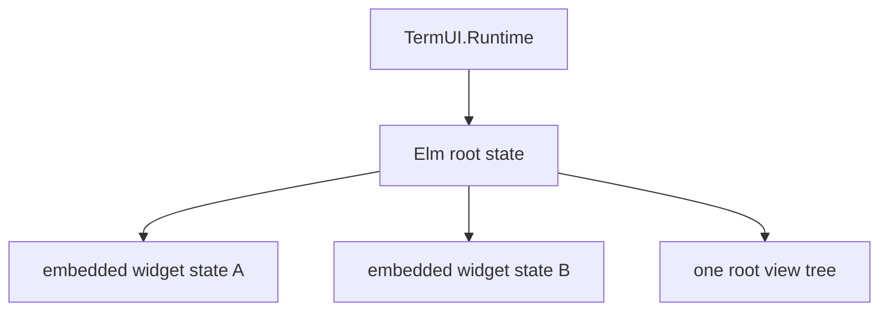
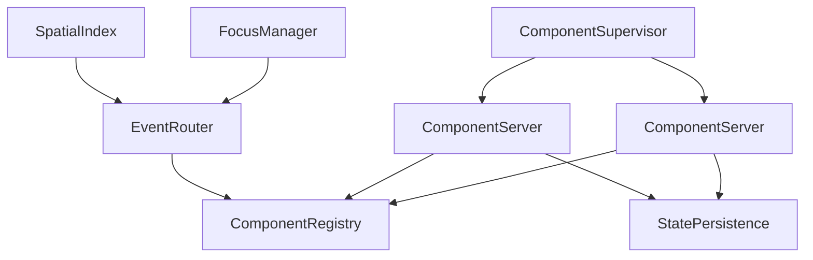

# Component Systems in TermUI 1.0

TermUI exposes two component models. They are complementary APIs, not one
automatically connected tree.

## Elm root and embedded widgets

This is the normal application architecture. `TermUI.Runtime` starts one root
module implementing `TermUI.Elm` and keeps one root state.



Stateless widgets are functions called from `view/1`. Stateful widgets are
explicit state machines:

```elixir
def init(_opts) do
  props = TermUI.Widgets.TextInput.new(placeholder: "Name")
  {:ok, input} = TermUI.Widgets.TextInput.init(props)
  %{input: input}
end

def event_to_msg(event, _state), do: {:msg, {:input_event, event}}

def update({:input_event, event}, state) do
  {:ok, input} = TermUI.Widgets.TextInput.handle_event(event, state.input)
  {%{state | input: input}, []}
end

def view(state) do
  TermUI.Widgets.TextInput.render(
    state.input,
    %{x: 0, y: 0, width: 40, height: 1}
  )
end
```

The root owns focus, event targeting, and widget state. The runtime's internal
`components` map contains only `:root`, and `:propagate` has no parent target.

## Component behaviours

`TermUI.Component` is the stateless `render/2` behaviour.

`TermUI.StatefulComponent` adds lifecycle, event, process-message, and call
callbacks. Built-in interactive widgets use this state-machine shape, but using
the behaviour does not itself start a process. The standard `ComponentServer`
invokes init/mount/props-update/event/unmount callbacks; it does not delegate
arbitrary GenServer calls or messages to `handle_call/3` or `handle_info/2`.

`TermUI.Container` adds child specifications, layout, routing decisions, and
child-message callbacks. The Elm runtime does not interpret those callbacks;
an application using Container must supply the component-tree integration.

## Process-oriented component services

The repository also ships a standalone lifecycle subsystem:



Start its services before use, normally in your own supervision tree. The APIs
have default registered names, so a single local set is expected unless the
module offers a naming option.

```elixir
children = [
  TermUI.ComponentRegistry,
  TermUI.Component.StatePersistence,
  TermUI.ComponentSupervisor
]

Supervisor.start_link(children, strategy: :one_for_one)
```

### Lifecycle

```elixir
{:ok, pid} =
  TermUI.ComponentSupervisor.start_component(MyComponent, props,
    id: :editor,
    recovery: :last_state
  )

:ok = TermUI.ComponentServer.mount(pid)
:ok = TermUI.ComponentServer.update_props(pid, new_props)
:ok = TermUI.ComponentServer.send_event(pid, event)
component_state = TermUI.ComponentServer.get_state(pid)
:ok = TermUI.ComponentServer.unmount(pid)
:ok = TermUI.ComponentSupervisor.stop_component(pid)
```

`ComponentServer` performs the lifecycle/event callbacks and recognizes its
legacy `{:send, pid, message}` and `{:timer, milliseconds, message}` command
tuples. Because the server has no component-message delegation, its timer tuple
will eventually be unhandled; use it only with a custom host that supplies that
delegation. `ComponentServer` does not expose `render/2`; call
`MyComponent.render(component_state, area)` in a custom rendering integration.

### Registry and hierarchy metadata

`TermUI.ComponentRegistry` maps component IDs to PIDs and stores parent/child
metadata. `set_parent/2` changes metadata; it does not establish supervision or
automatic visual composition.

### Routing and focus

`TermUI.EventRouter` routes to its focused ID or explicit target and can
broadcast to registered components. `TermUI.FocusManager` adds traversal,
groups, a modal focus stack, and trapping. Applications must keep their desired
focus/router relationship synchronized; neither service replaces the root-only
dispatch in `TermUI.Runtime`.

`TermUI.SpatialIndex.update/4` records bounds and z-index metadata.
`find_at/2` or `find_all_at/2` can select targets for mouse events in a custom
router. The default runtime does not query it.

### Recovery

`TermUI.Component.StatePersistence.persist/3` stores state and metadata,
`recover/2` reads it, and `record_restart/1` tracks restart history. Recovery is
used by `ComponentServer`; it is unrelated to Elm root state.

## Choosing a model

Use the Elm root with embedded widgets for applications built with
`TermUI.Runtime`. Choose the process services only when you intentionally need
independently hosted component lifecycles and are prepared to connect event
routing and rendering yourself.
