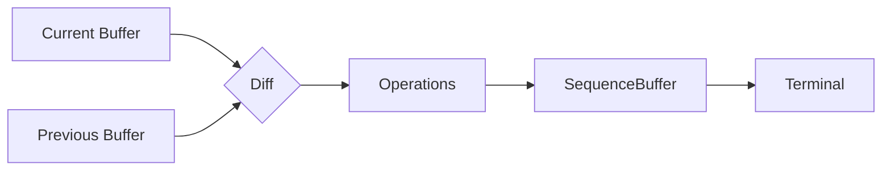
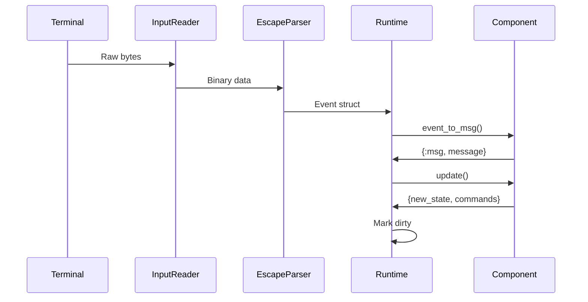
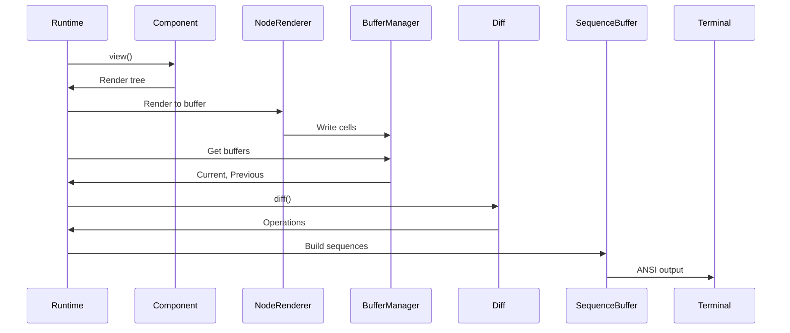

# Architecture Overview

This guide provides a high-level view of TermUI's internal architecture for developers contributing to the framework.

## System Layers

TermUI is organized into distinct layers, each with clear responsibilities:

```mermaid
graph TB
    subgraph "Application Layer"
        App[User Application]
        Elm[Elm Components]
    end

    subgraph "Framework Layer"
        Runtime[Runtime<br/>GenServer]
        MQ[MessageQueue]
        Cmd[Command Executor]
    end

    subgraph "Rendering Layer"
        NR[NodeRenderer]
        BM[BufferManager<br/>ETS]
        Diff[Diff Algorithm]
        SB[SequenceBuffer]
    end

    subgraph "Terminal Layer"
        Term[Terminal<br/>GenServer]
        IR[InputReader]
        EP[EscapeParser]
    end

    subgraph "System"
        TTY[/dev/tty]
        STDIN[stdin]
        STDOUT[stdout]
    end

    App --> Elm
    Elm --> Runtime
    Runtime --> MQ
    Runtime --> Cmd
    Runtime --> NR
    NR --> BM
    BM --> Diff
    Diff --> SB
    SB --> Term
    Term --> TTY
    Term --> STDOUT
    IR --> STDIN
    IR --> EP
    EP --> Runtime
```

## Layer Responsibilities

### Application Layer

**User code** that defines the UI behavior:
- Component modules using `use TermUI.Elm`
- State management via init/update/view
- Event handling via event_to_msg

### Framework Layer

**Core orchestration** managing the application lifecycle:

| Module | Responsibility |
|--------|----------------|
| `Runtime` | Event dispatch loop, component lifecycle, render scheduling |
| `MessageQueue` | FIFO queue for component messages |
| `Command` | Side effect execution (timers, I/O) |

### Rendering Layer

**Visual output** transforming state to terminal sequences:

| Module | Responsibility |
|--------|----------------|
| `NodeRenderer` | Traverses render tree, produces cells |
| `BufferManager` | Double-buffered ETS tables |
| `Diff` | Computes minimal update operations |
| `SequenceBuffer` | Batches ANSI escape sequences |

### Terminal Layer

**Low-level I/O** interfacing with the terminal:

| Module | Responsibility |
|--------|----------------|
| `Terminal` | Raw mode, screen control, cursor |
| `InputReader` | Reads stdin in raw mode |
| `EscapeParser` | Converts bytes to Event structs |

## Key Design Decisions

### 1. GenServer-Based Runtime

The Runtime is a GenServer that:
- Serializes event processing
- Manages component state
- Schedules rendering at 60 FPS
- Handles graceful shutdown

```elixir
# Simplified runtime state
%Runtime.State{
  root_module: MyApp,
  root_state: %{...},
  components: %{root: %{module: MyApp, state: %{...}}},
  message_queue: %MessageQueue{},
  dirty: true,
  render_interval: 16
}
```

### 2. ETS-Based Buffers

Screen buffers use ETS for:
- Lock-free concurrent reads
- O(1) cell access
- Atomic batch updates
- Memory efficiency

```elixir
# Cell storage: {{row, col}, cell}
:ets.insert(buffer.table, {{5, 10}, %Cell{char: "X", fg: :red}})
```

### 3. Differential Rendering

Only changed cells are sent to the terminal:



### 4. Message-Based Architecture

All communication uses messages:
- Events → Messages via `event_to_msg/2`
- Commands execute async, return messages
- No direct state mutation

## Module Dependency Graph

```mermaid
graph TD
    subgraph "Public API"
        TUI[TermUI]
        Runtime[Runtime]
    end

    subgraph "Components"
        Elm[Elm]
        Component[Component]
        Container[Container]
    end

    subgraph "Events"
        Event[Event]
        EventKey[Event.Key]
        EventMouse[Event.Mouse]
    end

    subgraph "Rendering"
        Style[Style]
        Cell[Cell]
        Buffer[Buffer]
        BufferMgr[BufferManager]
        Diff[Diff]
        NodeRenderer[NodeRenderer]
        SeqBuffer[SequenceBuffer]
    end

    subgraph "Terminal"
        Terminal[Terminal]
        InputReader[InputReader]
        EscapeParser[EscapeParser]
        ANSI[ANSI]
    end

    TUI --> Runtime
    Runtime --> Elm
    Runtime --> BufferMgr
    Runtime --> Terminal
    Runtime --> InputReader

    Elm --> Component
    Elm --> Event

    InputReader --> EscapeParser
    EscapeParser --> Event

    NodeRenderer --> Buffer
    NodeRenderer --> Cell
    NodeRenderer --> Style

    BufferMgr --> Buffer
    Buffer --> Cell

    Diff --> Buffer
    Diff --> Cell

    SeqBuffer --> Style
    SeqBuffer --> ANSI

    Terminal --> ANSI
```

## Process Architecture

At runtime, TermUI spawns these processes:

```mermaid
graph TB
    subgraph "Supervision Tree"
        App[Application Supervisor]
        Runtime[Runtime GenServer]
        Terminal[Terminal GenServer]
        BufferMgr[BufferManager GenServer]
        InputReader[InputReader Process]
    end

    App --> Runtime
    App --> Terminal
    App --> BufferMgr
    Runtime -.->|spawns| InputReader

    InputReader -->|{:input, event}| Runtime
    Runtime -->|render| BufferMgr
    Runtime -->|escape sequences| Terminal
```

## Data Flow

### Input Path



### Output Path



## File Organization

```
lib/term_ui/
├── term_ui.ex              # Public API
├── runtime.ex              # Core event loop
├── elm.ex                  # Elm Architecture macro
├── event.ex                # Event types
├── command.ex              # Command types
├── message_queue.ex        # Message queueing
│
├── terminal/
│   ├── terminal.ex         # Terminal GenServer
│   ├── input_reader.ex     # Stdin reader
│   └── escape_parser.ex    # Sequence parser
│
├── renderer/
│   ├── style.ex            # Style struct
│   ├── cell.ex             # Cell struct
│   ├── buffer.ex           # Buffer operations
│   ├── buffer_manager.ex   # Double buffering
│   ├── diff.ex             # Diff algorithm
│   ├── sequence_buffer.ex  # ANSI batching
│   └── node_renderer.ex    # Tree → cells
│
├── layout/
│   ├── constraint.ex       # Size constraints
│   └── solver.ex           # Constraint solver
│
└── widgets/
    ├── gauge.ex            # Gauge widget
    ├── sparkline.ex        # Sparkline widget
    └── table.ex            # Table widget
```

## Next Steps

- [Runtime Internals](02-runtime-internals.md) - Deep dive into the event loop
- [Rendering Pipeline](03-rendering-pipeline.md) - How frames are produced
- [Event System](04-event-system.md) - Input handling details
