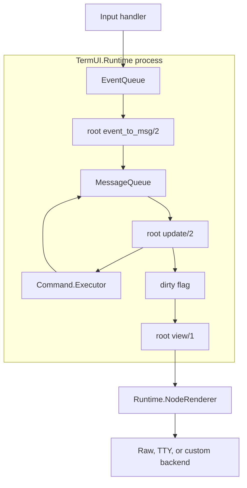

# Architecture Overview

TermUI 1.0 has one integrated application runtime and several optional service
modules. Keeping those two categories separate is essential when reading the
code.

## Integrated runtime

`TermUI.Runtime` is a GenServer that runs one root module implementing
`TermUI.Elm`. It owns the root state, bounded event and message queues, command
executor, backend state, input reader, and render scheduling.

```mermaid
flowchart TB
  subgraph Runtime[TermUI.Runtime process]
    EQ[EventQueue] --> ETM[root event_to_msg/2]
    ETM --> MQ[MessageQueue]
    MQ --> UP[root update/2]
    UP --> CE[Command.Executor]
    CE --> MQ
    UP --> DIRTY[dirty flag]
    DIRTY --> VIEW[root view/1]
  end

  INPUT[Input handler] --> EQ
  VIEW --> NODE[Runtime.NodeRenderer]
  NODE --> BACKEND[Raw, TTY, or custom backend]
```

The runtime state's `components` map contains only the reserved `:root` entry.
`focused_component` is likewise `:root`. There is no public API in 1.0 for
registering more modules in this runtime map.

## Widgets and composition

There are two widget styles:

- Stateless widgets are render functions called by the root. Some implement
  the `TermUI.Component` `render/2` behaviour; visualization helpers such as
  Gauge and Sparkline expose `render/1` directly.
- `TermUI.StatefulComponent` widgets expose `new/1`, `init/1`,
  `handle_event/2`, and `render/2`. Their state lives inside the root state.

The root decides which widget receives an event and stores every widget's new
state. Layout is expressed through render nodes and constraints, not through
runtime child processes.

## Rendering

`view/1` can return struct render nodes from `TermUI.Component.Helpers`, tuple
nodes from `TermUI.Elm.Helpers`, lists, and the viewport/overlay maps produced
by widgets. `TermUI.Runtime.NodeRenderer` rasterizes these values into
`TermUI.Renderer.Buffer` cells.

Raw and custom backends use `TermUI.Renderer.BufferManager` to compare current
and previous buffers. TTY renders into a temporary buffer and sends a complete
frame of displayable cells to `TermUI.Backend.TTY`, whose default line mode is
`:full_redraw`.

## Backend and input ownership

- `:auto` tries native Raw mode on supported OTP/Unix systems and otherwise
  selects TTY. In IEx, `:auto` resolves directly to TTY.
- Raw uses `TermUI.Terminal` and normally the legacy asynchronous
  `TermUI.Terminal.InputReader`; `use_input_handler: true` selects
  `TermUI.Input.Raw`.
- TTY always uses `TermUI.Input.TTY` in a dedicated reader process. It stays in
  cooked mode, so the terminal can buffer input until Enter.
- `TermUI.Backend.SSH` is an explicit custom backend for independent OTP SSH
  channel sessions.

## Optional process-oriented subsystem

The following modules are independently useful but are not wired into the
runtime diagram above:

- `TermUI.ComponentServer` hosts one stateful component lifecycle.
- `TermUI.ComponentSupervisor` starts component servers dynamically.
- `TermUI.ComponentRegistry` stores IDs and parent/child metadata.
- `TermUI.EventRouter`, `TermUI.FocusManager`, and `TermUI.SpatialIndex` provide
  routing primitives when an application populates them.
- `TermUI.Component.StatePersistence` stores recovery state in ETS.

An application choosing this subsystem must start its services and connect
rendering/event flow itself.

## Source map

| Concern | Primary implementation |
|---|---|
| Application loop | `TermUI.Runtime` |
| Elm contract | `TermUI.Elm` |
| Commands | `TermUI.Command`, `TermUI.Command.Executor` |
| Rasterization | `TermUI.Runtime.NodeRenderer` |
| Cells/buffers | `TermUI.Renderer.Cell`, `TermUI.Renderer.Buffer` |
| Backend contract | `TermUI.Backend` |
| Local terminal ownership | `TermUI.Terminal` |
| Input parsing | `TermUI.Terminal.EscapeParser` |

Next: [Runtime Internals](02-runtime-internals.md).
