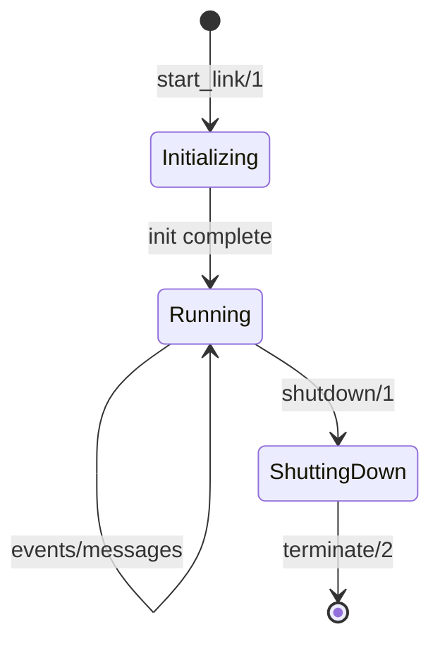
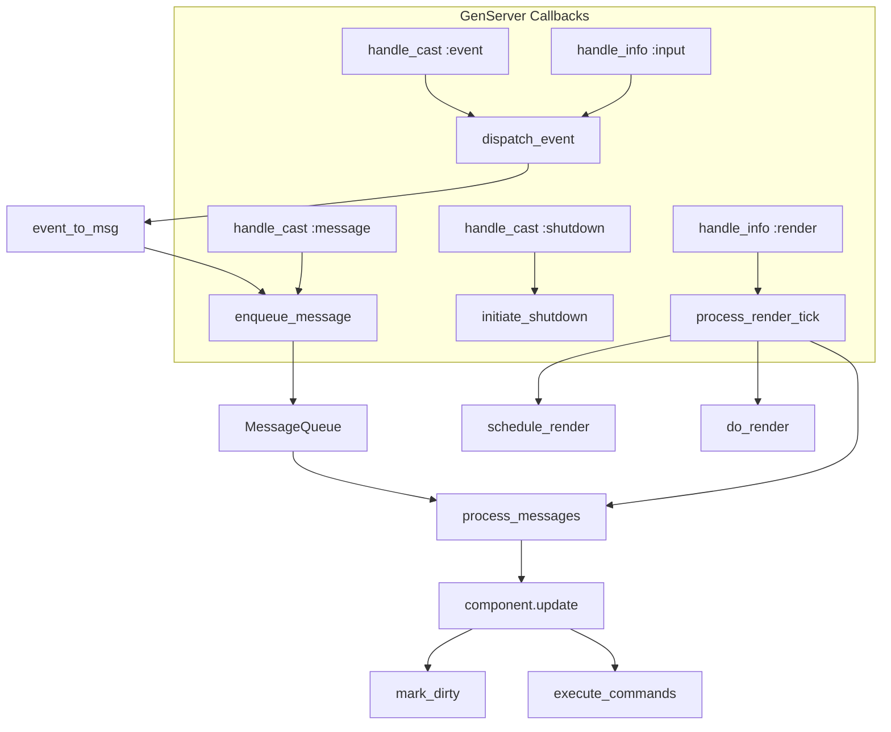
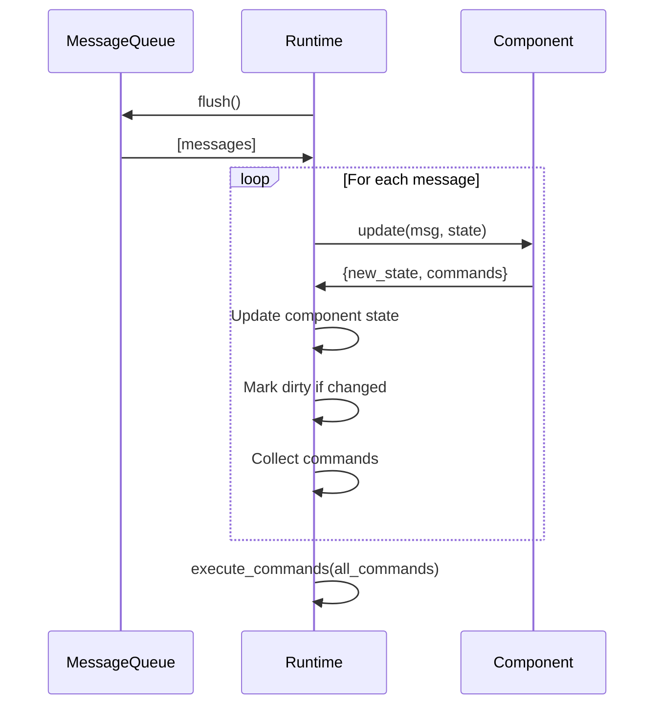
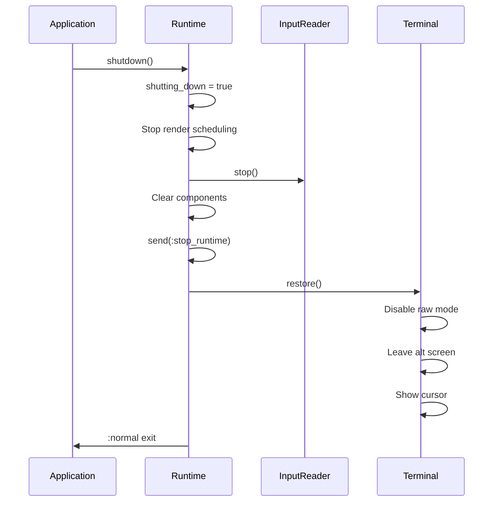

# Runtime Internals

The Runtime (`TermUI.Runtime`) is the central orchestrator of a TermUI application. This guide explains its internal workings.

## Overview

The Runtime is a GenServer that:
1. Manages component state
2. Dispatches events to components
3. Processes messages through the update cycle
4. Executes commands
5. Schedules and performs rendering

## State Structure

```elixir
%TermUI.Runtime.State{
  # Component configuration
  root_module: MyApp.Counter,           # Root component module
  root_state: %{count: 0},              # Root component state

  # Component registry
  components: %{
    root: %{module: MyApp.Counter, state: %{count: 0}}
  },

  # Message processing
  message_queue: %MessageQueue{},       # Pending messages
  pending_commands: %{},                # Executing commands

  # Rendering
  dirty: false,                         # Needs re-render?
  render_interval: 16,                  # ~60 FPS
  buffer_manager: #PID<...>,            # BufferManager process
  dimensions: {80, 24},                 # {cols, rows}

  # Terminal
  terminal_started: true,               # Terminal available?
  input_reader: #PID<...>,              # InputReader process

  # Lifecycle
  focused_component: :root,             # Currently focused
  shutting_down: false                  # Shutdown in progress?
}
```

## Lifecycle



### Initialization

```elixir
def init(opts) do
  # 1. Trap exits for cleanup
  Process.flag(:trap_exit, true)

  # 2. Initialize terminal
  {terminal_started, buffer_manager, dimensions} = initialize_terminal()

  # 3. Initialize root component
  root_state = root_module.init(opts)

  # 4. Start input reader
  {:ok, reader} = InputReader.start_link(target: self())

  # 5. Schedule first render
  schedule_render(render_interval)

  {:ok, state}
end
```

### Main Loop

The Runtime handles these message types:



## Event Dispatch

Events are routed based on type:

```elixir
defp dispatch_event(%Event.Key{} = event, state) do
  # Keyboard → focused component
  dispatch_to_component(state.focused_component, event, state)
end

defp dispatch_event(%Event.Mouse{} = event, state) do
  # Mouse → component at position (future: spatial index)
  dispatch_to_component(:root, event, state)
end

defp dispatch_event(%Event.Resize{} = event, state) do
  # Resize → broadcast to all
  broadcast_event(event, state)
end
```

### Component Dispatch

```elixir
defp dispatch_to_component(component_id, event, state) do
  %{module: module, state: component_state} = state.components[component_id]

  case module.event_to_msg(event, component_state) do
    {:msg, message} ->
      enqueue_message(component_id, message, state)

    :ignore ->
      state

    :propagate ->
      # Would bubble to parent
      state
  end
end
```

## Message Processing

Messages are processed in FIFO order:



```elixir
defp process_messages(state) do
  {messages, queue} = MessageQueue.flush(state.message_queue)

  {state, commands} =
    Enum.reduce(messages, {state, []}, fn {component_id, msg}, {acc, cmds} ->
      {new_state, new_cmds} = process_message(component_id, msg, acc)
      {new_state, cmds ++ new_cmds}
    end)

  execute_commands(commands, state)
end
```

## Command Execution

Commands are side effects returned from `update/2`:

```elixir
defp execute_commands(commands, state) do
  # Check for quit command
  if has_quit_command?(commands) do
    GenServer.cast(self(), :shutdown)
    %{state | shutting_down: true}
  else
    # Track pending commands
    pending = Enum.reduce(commands, state.pending_commands, fn cmd, acc ->
      command_id = make_ref()
      Map.put(acc, command_id, cmd)
    end)

    %{state | pending_commands: pending}
  end
end
```

### Timer Commands

Timer commands use `Process.send_after/3`:

```elixir
# When timer fires, result delivered as message
def handle_info({:command_result, component_id, cmd_id, result}, state) do
  state = handle_command_result(component_id, cmd_id, result, state)
  {:noreply, state}
end
```

## Render Cycle

Rendering is scheduled at a fixed interval (default 16ms ≈ 60 FPS):

```elixir
defp process_render_tick(state) do
  # 1. Process pending messages
  state = process_messages(state)

  # 2. Render if dirty
  state = if state.dirty and not state.shutting_down do
    do_render(state)
  else
    state
  end

  # 3. Schedule next tick
  unless state.shutting_down do
    schedule_render(state.render_interval)
  end

  state
end

defp schedule_render(interval) do
  Process.send_after(self(), :render, interval)
end
```

### Render Flow

```elixir
defp do_render(state) do
  # 1. Get render tree from component
  %{module: module, state: comp_state} = state.components[:root]
  render_tree = module.view(comp_state)

  # 2. Clear current buffer
  BufferManager.clear_current(state.buffer_manager)

  # 3. Render tree to buffer
  NodeRenderer.render_to_buffer(render_tree, state.buffer_manager)

  # 4. Diff against previous
  current = BufferManager.get_current_buffer(state.buffer_manager)
  previous = BufferManager.get_previous_buffer(state.buffer_manager)
  operations = Diff.diff(current, previous)

  # 5. Output to terminal
  render_operations(operations)

  # 6. Swap buffers
  BufferManager.swap_buffers(state.buffer_manager)

  %{state | dirty: false}
end
```

## Shutdown

Graceful shutdown preserves terminal state:



```elixir
def terminate(_reason, state) do
  # Stop input reader
  if state.input_reader do
    InputReader.stop(state.input_reader)
  end

  # Restore terminal
  if state.terminal_started do
    Terminal.restore()
  end

  :ok
end
```

## Error Handling

The Runtime protects against component crashes:

```elixir
# In event_to_msg
try do
  module.event_to_msg(event, component_state)
rescue
  error ->
    Logger.error("Component crashed in event_to_msg: #{inspect(error)}")
    state  # Return unchanged
end

# In update
try do
  module.update(message, component_state)
rescue
  error ->
    Logger.error("Component crashed in update: #{inspect(error)}")
    {state, []}  # Return unchanged, no commands
end

# In view
try do
  module.view(component_state)
rescue
  error ->
    Logger.error("Component crashed in view: #{inspect(error)}")
    {:text, "[Render Error]"}  # Fallback render
end
```

## Performance Considerations

### Message Batching

Multiple events arriving between render ticks are batched:

```
Event 1 → Queue
Event 2 → Queue
Event 3 → Queue
Render tick → Process all 3 → Single render
```

### Dirty Tracking

Components are only re-rendered when state changes:

```elixir
dirty = state.dirty or new_component_state != component_state
```

### Buffer Swapping

Double buffering avoids copying:

```elixir
# O(1) pointer swap, not O(rows*cols) copy
def swap_buffers(state) do
  %{state | current: state.previous, previous: state.current}
end
```

## Testing the Runtime

```elixir
# Start without terminal for testing
{:ok, runtime} = Runtime.start_link(
  root: TestComponent,
  skip_terminal: true
)

# Send events
Runtime.send_event(runtime, Event.key(:enter))

# Wait for processing
Runtime.sync(runtime)

# Check state
state = Runtime.get_state(runtime)
assert state.root_state.submitted == true
```

## Next Steps

- [Rendering Pipeline](03-rendering-pipeline.md) - Detailed render flow
- [Event System](04-event-system.md) - Input handling
- [Buffer Management](05-buffer-management.md) - ETS buffers
