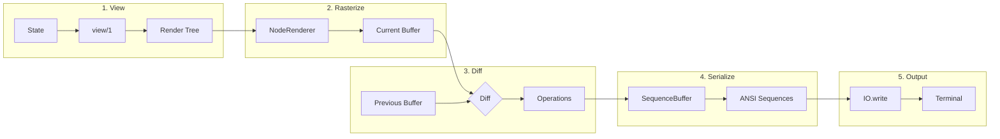
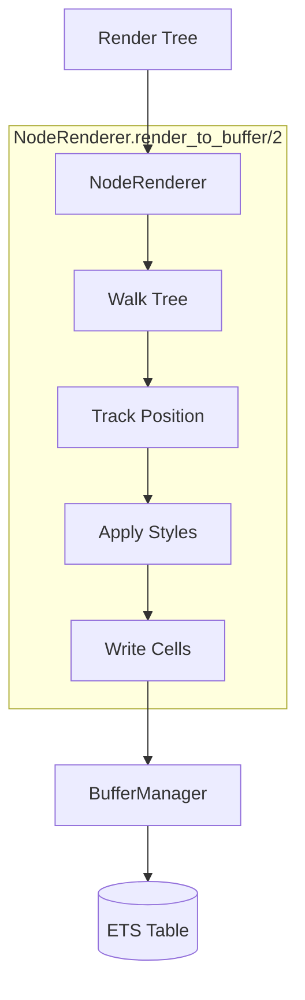
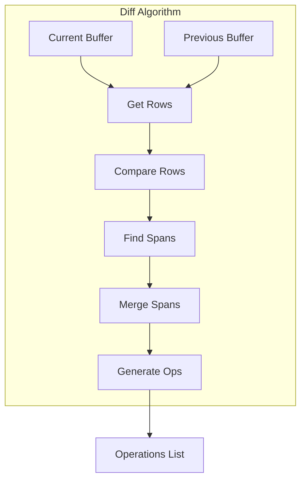
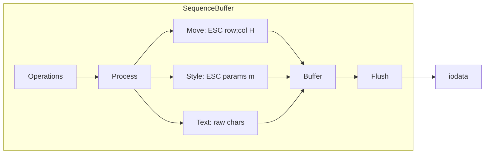

# Rendering Pipeline

This guide explains how TermUI transforms component state into terminal output.

## Pipeline Overview



## Stage 1: View

The component's `view/1` function produces a render tree:

```elixir
def view(state) do
  stack(:vertical, [
    text("Counter", Style.new(fg: :cyan, attrs: [:bold])),
    text("Value: #{state.count}")
  ])
end
```

### Render Tree Nodes

The tree consists of tuples describing content:

```elixir
# Text node
{:text, "Hello", %Style{}}

# Stack (layout container)
{:stack, :vertical, [child1, child2, ...]}
{:stack, :horizontal, [child1, child2, ...]}

# Styled wrapper
{:styled, %Style{}, child}

# Fragment (multiple nodes)
{:fragment, [child1, child2, ...]}

# Raw cells
{:cells, [%Cell{}, %Cell{}, ...]}

# Viewport (scrollable clipped region)
%{
  type: :viewport,
  content: child_node,      # Content to render
  scroll_x: 0,              # Horizontal scroll offset
  scroll_y: 0,              # Vertical scroll offset
  width: 40,                # Viewport width
  height: 20                # Viewport height
}
```

## Stage 2: Rasterize

`NodeRenderer` traverses the tree and writes cells to the buffer:



### Node Rendering

```elixir
defp render_node({:text, content, style}, row, col, buffer) do
  # Convert each grapheme to a styled cell
  cells = content
    |> String.graphemes()
    |> Enum.with_index()
    |> Enum.map(fn {char, i} ->
      {row, col + i, Style.to_cell(style, char)}
    end)

  BufferManager.set_cells(buffer, cells)
  {row, col + String.length(content)}
end

defp render_node({:stack, :vertical, children}, row, col, buffer) do
  Enum.reduce(children, {row, col}, fn child, {r, c} ->
    {new_row, _} = render_node(child, r, c, buffer)
    {new_row + 1, col}  # Move to next row
  end)
end

defp render_node({:stack, :horizontal, children}, row, col, buffer) do
  Enum.reduce(children, {row, col}, fn child, {r, c} ->
    {_, new_col} = render_node(child, r, c, buffer)
    {row, new_col}  # Move to next column
  end)
end
```

### Viewport Rendering

Viewport nodes clip content to a visible region with scroll offsets:

```elixir
defp render_viewport(content, buffer, dest_row, dest_col, style,
                     scroll_x, scroll_y, vp_width, vp_height) do
  # 1. Create temporary buffer for full content
  {:ok, temp_buffer} = Buffer.new(content_height, content_width)

  # 2. Render content to temporary buffer
  render_node(content, temp_buffer, 1, 1, style)

  # 3. Copy visible region to destination buffer
  for dy <- 0..(vp_height - 1), dx <- 0..(vp_width - 1) do
    src_row = scroll_y + 1 + dy
    src_col = scroll_x + 1 + dx
    cell = Buffer.get_cell(temp_buffer, src_row, src_col)
    Buffer.set_cell(buffer, dest_row + dy, dest_col + dx, cell)
  end

  # 4. Clean up temporary buffer
  Buffer.destroy(temp_buffer)

  {vp_width, vp_height}
end
```

This approach:
- Renders full content to an off-screen buffer
- Copies only the visible portion based on scroll offsets
- Clips content automatically to viewport dimensions

## Stage 3: Diff

The diff algorithm compares current and previous buffers:



### Diff Process

```elixir
def diff(current, previous) do
  {rows, cols} = Buffer.dimensions(current)

  1..rows
  |> Enum.flat_map(fn row ->
    diff_row(current, previous, row, cols)
  end)
  |> optimize_operations()
end
```

### Finding Changed Spans

```elixir
def find_changed_spans(current_cells, previous_cells, row) do
  current_cells
  |> Enum.zip(previous_cells)
  |> Enum.reduce({[], nil}, fn {{col, curr}, {_, prev}}, acc ->
    if Cell.equal?(curr, prev) do
      close_span(acc)
    else
      extend_span(acc, col, curr, row)
    end
  end)
  |> finalize()
end
```

### Span Merging

Small gaps between spans are merged to reduce cursor movements:

```
Before:  [CHANGED]...[CHANGED]  (3 char gap)
After:   [CHANGED...CHANGED]    (merged)
```

```elixir
@merge_gap_threshold 3

defp merge_spans(spans) do
  Enum.reduce(spans, [], fn span, acc ->
    case acc do
      [prev | rest] when span.start_col - prev.end_col <= @merge_gap_threshold ->
        [merge(prev, span) | rest]
      _ ->
        [span | acc]
    end
  end)
end
```

### Operation Types

```elixir
@type operation ::
  {:move, row, col}     # Move cursor
  | {:style, Style.t()} # Set SGR attributes
  | {:text, String.t()} # Output text
  | :reset              # Reset all attributes
```

## Stage 4: Serialize

`SequenceBuffer` converts operations to ANSI escape sequences:



### Style Delta Encoding

Only changed style attributes are emitted:

```elixir
defp style_to_sgr_params(style, last_style) do
  params = []

  # Only emit fg if changed
  params = if style.fg != last_style.fg do
    [color_to_sgr(:fg, style.fg) | params]
  else
    params
  end

  # Only emit bg if changed
  params = if style.bg != last_style.bg do
    [color_to_sgr(:bg, style.bg) | params]
  else
    params
  end

  # Handle attribute changes
  # ...

  params
end
```

### SGR Sequence Building

```elixir
defp build_sgr_sequence(params) do
  # ESC[param1;param2;...m
  ["\e[", Enum.intersperse(params, ";"), "m"]
end

# Examples:
# Red foreground: \e[31m
# Bold + blue: \e[1;34m
# Reset: \e[0m
```

## Stage 5: Output

The final iodata is written to the terminal:

```elixir
defp render_operations(operations) do
  seq_buffer = SequenceBuffer.new()

  seq_buffer =
    Enum.reduce(operations, seq_buffer, fn op, buf ->
      apply_operation(op, buf)
    end)

  # Reset at end to avoid style bleeding
  seq_buffer = SequenceBuffer.append!(seq_buffer, "\e[0m")

  {output, _} = SequenceBuffer.flush(seq_buffer)
  IO.write(output)
end
```

## Optimization Techniques

### 1. Cursor Movement Optimization

Choose shortest cursor movement sequence:

```elixir
# Absolute: \e[row;colH (variable length)
# Relative: \e[nA/B/C/D (if small delta)

defp optimal_move(from_row, from_col, to_row, to_col) do
  # Calculate costs and choose cheapest
end
```

### 2. Batch Cell Writes

ETS batch insert for multiple cells:

```elixir
def set_cells(buffer, cells) do
  entries = Enum.map(cells, fn {row, col, cell} ->
    {{row, col}, cell}
  end)
  :ets.insert(buffer.table, entries)
end
```

### 3. Style Deduplication

Adjacent cells with same style share one SGR sequence:

```elixir
# Instead of:
# \e[31mH\e[31me\e[31ml\e[31ml\e[31mo
# Produces:
# \e[31mHello
```

### 4. Frame Rate Limiting

Rendering capped at 60 FPS (16ms intervals):

```elixir
# Even if 100 events arrive, max 60 renders/sec
schedule_render(16)  # milliseconds
```

## Performance Metrics

### Typical Frame Budget

For 60 FPS, each frame has ~16ms:

| Stage | Typical Time |
|-------|-------------|
| View | 0.1-1ms |
| Rasterize | 0.5-2ms |
| Diff | 0.2-1ms |
| Serialize | 0.1-0.5ms |
| Output | 0.5-2ms |
| **Total** | **1.4-6.5ms** |

### Scaling Factors

| Factor | Impact |
|--------|--------|
| Screen size | O(rows × cols) for full diff |
| Changed cells | O(n) where n = changed |
| Style changes | More SGR sequences |
| Unicode width | Display width calculation |

## Debugging Rendering

### Inspect Render Tree

```elixir
def view(state) do
  tree = build_tree(state)
  IO.inspect(tree, label: "Render Tree")
  tree
end
```

### Inspect Operations

```elixir
# In Runtime.do_render/1
operations = Diff.diff(current, previous)
IO.inspect(operations, label: "Diff Operations")
```

### Buffer Contents

```elixir
buffer = BufferManager.get_current_buffer()
{rows, cols} = Buffer.dimensions(buffer)

for row <- 1..rows do
  cells = Buffer.get_row(buffer, row)
  line = Enum.map_join(cells, & &1.char)
  IO.puts(line)
end
```

## Next Steps

- [Buffer Management](05-buffer-management.md) - ETS buffer details
- [Terminal Layer](06-terminal-layer.md) - ANSI sequence handling
- [Event System](04-event-system.md) - Input processing
