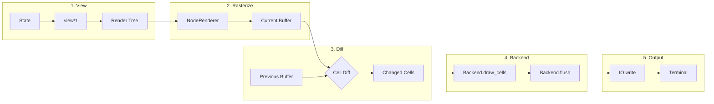
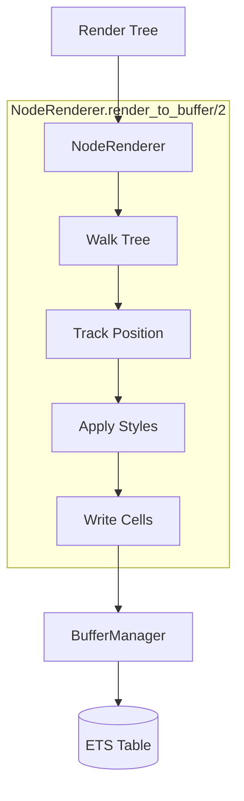
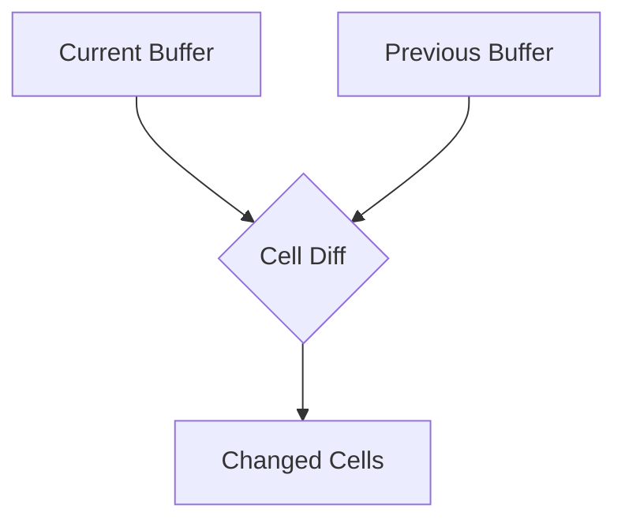

# Rendering Pipeline

This guide explains how TermUI transforms component state into terminal output.

## Pipeline Overview


```mermaid
graph LR
    subgraph "1. View"
        S[State] --> V[view/1]
        V --> RT[Render Tree]
    end

    subgraph "2. Rasterize"
        RT --> NR[NodeRenderer]
        NR --> CB[Current Buffer]
    end

    subgraph "3. Diff"
        CB --> D{Cell Diff}
        PB[Previous Buffer] --> D
        D --> CC[Changed Cells]
    end

    subgraph "4. Backend"
        CC --> BE[Backend.draw_cells]
        BE --> FL[Backend.flush]
    end

    subgraph "5. Output"
        FL --> IO[IO.write]
        IO --> T[Terminal]
    end
```

## Stage 1: View

The component's `view/1` function produces a render tree:

```elixir
def view(state) do
  stack(:vertical, [
    text("Counter", Style.new(fg: :cyan, attrs: [:bold])),
    text("Value: #{state.count}")
  ])
end
```

### Render Tree Nodes

The tree consists of tuples describing content:

```elixir
# Text node
{:text, "Hello", %Style{}}

# Stack (layout container)
{:stack, :vertical, [child1, child2, ...]}
{:stack, :horizontal, [child1, child2, ...]}

# Styled wrapper
{:styled, %Style{}, child}

# Fragment (multiple nodes)
{:fragment, [child1, child2, ...]}

# Raw cells
{:cells, [%Cell{}, %Cell{}, ...]}

# Viewport (scrollable clipped region)
%{
  type: :viewport,
  content: child_node,      # Content to render
  scroll_x: 0,              # Horizontal scroll offset
  scroll_y: 0,              # Vertical scroll offset
  width: 40,                # Viewport width
  height: 20                # Viewport height
}
```

## Stage 2: Rasterize

`NodeRenderer` traverses the tree and writes cells to the buffer:


```mermaid
graph TD
    RT[Render Tree] --> NR[NodeRenderer]

    subgraph "NodeRenderer.render_to_buffer/2"
        NR --> Walk[Walk Tree]
        Walk --> Pos[Track Position]
        Pos --> Style[Apply Styles]
        Style --> Write[Write Cells]
    end

    Write --> BM[BufferManager]
    BM --> ETS[(ETS Table)]
```

### Node Rendering

```elixir
defp render_node({:text, content, style}, row, col, buffer) do
  # Convert each grapheme to a styled cell
  cells = content
    |> String.graphemes()
    |> Enum.with_index()
    |> Enum.map(fn {char, i} ->
      {row, col + i, Style.to_cell(style, char)}
    end)

  BufferManager.set_cells(buffer, cells)
  {row, col + String.length(content)}
end

defp render_node({:stack, :vertical, children}, row, col, buffer) do
  Enum.reduce(children, {row, col}, fn child, {r, c} ->
    {new_row, _} = render_node(child, r, c, buffer)
    {new_row + 1, col}  # Move to next row
  end)
end

defp render_node({:stack, :horizontal, children}, row, col, buffer) do
  Enum.reduce(children, {row, col}, fn child, {r, c} ->
    {_, new_col} = render_node(child, r, c, buffer)
    {row, new_col}  # Move to next column
  end)
end
```

### Viewport Rendering

Viewport nodes clip content to a visible region with scroll offsets:

```elixir
defp render_viewport(content, buffer, dest_row, dest_col, style,
                     scroll_x, scroll_y, vp_width, vp_height) do
  # 1. Create temporary buffer for full content
  {:ok, temp_buffer} = Buffer.new(content_height, content_width)

  # 2. Render content to temporary buffer
  render_node(content, temp_buffer, 1, 1, style)

  # 3. Copy visible region to destination buffer
  for dy <- 0..(vp_height - 1), dx <- 0..(vp_width - 1) do
    src_row = scroll_y + 1 + dy
    src_col = scroll_x + 1 + dx
    cell = Buffer.get_cell(temp_buffer, src_row, src_col)
    Buffer.set_cell(buffer, dest_row + dy, dest_col + dx, cell)
  end

  # 4. Clean up temporary buffer
  Buffer.destroy(temp_buffer)

  {vp_width, vp_height}
end
```

This approach:
- Renders full content to an off-screen buffer
- Copies only the visible portion based on scroll offsets
- Clips content automatically to viewport dimensions

## Stage 3: Diff

The runtime compares current and previous buffers and produces a flat list of
changed cells to send to the backend.


```mermaid
graph TB
    CB[Current Buffer] --> D{Cell Diff}
    PB[Previous Buffer] --> D
    D --> CC[Changed Cells]
```

### Diff Process (simplified)

```elixir
defp get_changed_cells(current, previous) do
  {rows, cols} = Buffer.dimensions(current)

  for row <- 1..rows, reduce: [] do
    acc ->
      current_row = Buffer.get_row(current, row)
      previous_row = Buffer.get_row(previous, row)

      Enum.reduce(1..cols, acc, fn col, acc2 ->
        curr = Enum.at(current_row, col - 1)
        prev = Enum.at(previous_row, col - 1)

        if Cell.equal?(curr, prev) do
          acc2
        else
          [%{row: row, col: col, cell: curr} | acc2]
        end
      end)
  end
end
```

## Stage 4: Backend Encode

Backends accept changed cells and emit ANSI sequences. Raw mode uses
double-buffer diffing; TTY mode renders a full frame and still delegates
cell encoding to the backend.

```elixir
{:ok, backend_state} = backend.draw_cells(backend_state, cells)
{:ok, backend_state} = backend.flush(backend_state)
```

Backends handle cursor movement optimization and style encoding.

## Stage 5: Output

`Backend.flush/1` writes accumulated output via `IO.write/1` to the terminal.

## Optimization Techniques

### 1. Cursor Movement Optimization

Choose shortest cursor movement sequence:

```elixir
# Absolute: \e[row;colH (variable length)
# Relative: \e[nA/B/C/D (if small delta)

defp optimal_move(from_row, from_col, to_row, to_col) do
  # Calculate costs and choose cheapest
end
```

### 2. Batch Cell Writes

ETS batch insert for multiple cells:

```elixir
def set_cells(buffer, cells) do
  entries = Enum.map(cells, fn {row, col, cell} ->
    {{row, col}, cell}
  end)
  :ets.insert(buffer.table, entries)
end
```

### 3. Style Deduplication

Adjacent cells with same style share one SGR sequence:

```elixir
# Instead of:
# \e[31mH\e[31me\e[31ml\e[31ml\e[31mo
# Produces:
# \e[31mHello
```

### 4. Frame Rate Limiting

Rendering capped at 60 FPS (16ms intervals):

```elixir
# Even if 100 events arrive, max 60 renders/sec
schedule_render(16)  # milliseconds
```

## Performance Metrics

### Typical Frame Budget

For 60 FPS, each frame has ~16ms:

| Stage | Typical Time |
|-------|-------------|
| View | 0.1-1ms |
| Rasterize | 0.5-2ms |
| Diff | 0.2-1ms |
| Backend Encode | 0.1-0.5ms |
| Output | 0.5-2ms |
| **Total** | **1.4-6.5ms** |

### Scaling Factors

| Factor | Impact |
|--------|--------|
| Screen size | O(rows × cols) for full diff |
| Changed cells | O(n) where n = changed |
| Style changes | More SGR sequences |
| Unicode width | Display width calculation |

## Debugging Rendering

### Inspect Render Tree

```elixir
def view(state) do
  tree = build_tree(state)
  IO.inspect(tree, label: "Render Tree")
  tree
end
```

### Inspect Changed Cells

```elixir
# In Runtime.do_render/1
cells = get_changed_cells(current, previous)
IO.inspect(cells, label: "Changed Cells")
```

### Buffer Contents

```elixir
buffer = BufferManager.get_current_buffer()
{rows, cols} = Buffer.dimensions(buffer)

for row <- 1..rows do
  cells = Buffer.get_row(buffer, row)
  line = Enum.map_join(cells, & &1.char)
  IO.puts(line)
end
```

## Next Steps

- [Buffer Management](05-buffer-management.md) - ETS buffer details
- [Terminal Layer](06-terminal-layer.md) - ANSI sequence handling
- [Event System](04-event-system.md) - Input processing
