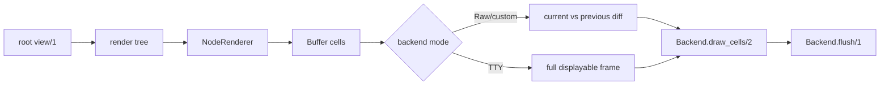

# Rendering Pipeline

The integrated pipeline is implemented by `TermUI.Runtime` and
`TermUI.Runtime.NodeRenderer`.

```mermaid
flowchart LR
  V[root view/1] --> T[render tree]
  T --> N[NodeRenderer]
  N --> C[Buffer cells]
  C --> R{backend mode}
  R -->|Raw/custom| D[current vs previous diff]
  R -->|TTY| F[full displayable frame]
  D --> B[Backend.draw_cells/2]
  F --> B
  B --> O[Backend.flush/1]
```

## Render trees

`use TermUI.Elm` imports two compatible helper families:

- `TermUI.Component.Helpers` produces `%TermUI.Component.RenderNode{}` values
  through `text`, `styled`, `box`, `stack`, `cells`, and `empty`.
- `TermUI.Elm.Helpers` supplies tuple-based `row`, `column`, and `fragment`
  helpers. Its conflicting text/box helpers are not imported by the macro.

The node renderer also understands lists, constraint-wrapped stack children,
and the viewport/overlay maps produced by widgets. Unknown values render
nothing.

## Layout and rasterization

Vertical and horizontal stacks allocate child space. A child can be paired
with a `TermUI.Layout.Constraint`; `TermUI.Layout.Solver` computes its share of
the available stack dimension. Rendering is clipped by buffer bounds.

Text is split on newlines and converted to `TermUI.Renderer.Cell` structs.
Parent and node styles are merged, and wide-character placeholders are retained
in the buffer so later cells remain aligned.

## Raw and custom backend path

These modes own a `TermUI.Renderer.BufferManager` with current and previous ETS
buffers. Each dirty frame clears the current buffer, rasterizes the complete
tree, compares cells with the previous buffer, emits changed cells and needed
clears, then swaps the buffers.

The runtime performs this comparison itself. `TermUI.Renderer.Diff` is a public
standalone utility and is not called by the integrated runtime.

## TTY path

TTY creates a temporary buffer for each dirty frame, rasterizes the tree, and
extracts all non-space cells plus spaces with non-default backgrounds. The
backend receives that full set and defaults to `line_mode: :full_redraw`.
Therefore claims about differential output apply to Raw/custom operation, not
the default TTY path.

## Scheduling

The runtime schedules a render message every 16 ms by default. It calls
`view/1` only when its own `dirty` flag is true. The separate
`TermUI.Renderer.FramerateLimiter` and `TermUI.ViewCache` modules are opt-in
utilities, not part of this loop.

## Direct testing

For rasterization tests, create a `TermUI.Renderer.Buffer` or
`TermUI.Renderer.BufferManager` and call
`TermUI.Runtime.NodeRenderer.render_to_buffer_direct/4` or
`render_to_buffer/4`. Always destroy standalone buffers after use.

Next: [Event System](04-event-system.md).
