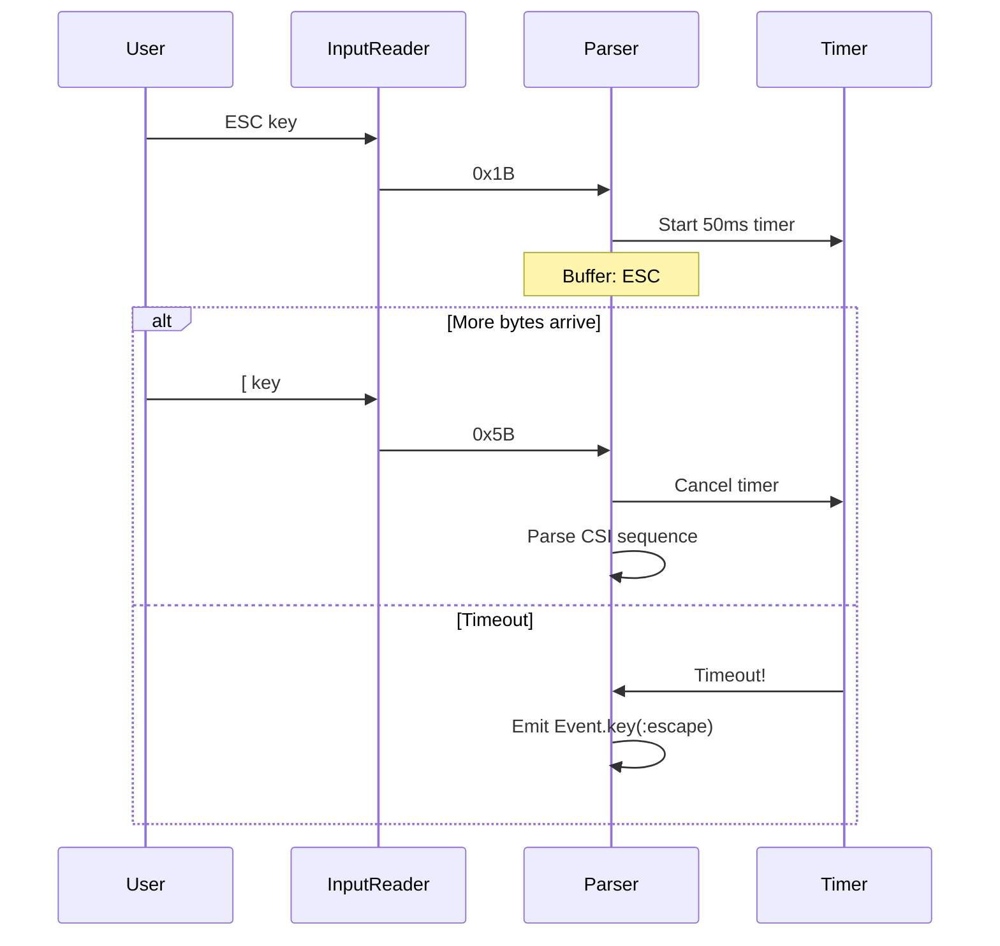

# Event System

This guide explains how TermUI captures, parses, and dispatches terminal input events.

## Event Flow Overview

```mermaid
graph LR
    subgraph "Terminal"
        KB[Keyboard] --> TTY[/dev/tty]
        MS[Mouse] --> TTY
    end

    subgraph "Input Layer"
        TTY --> IR[InputReader]
        IR --> EP[EscapeParser]
        EP --> EV[Event Structs]
    end

    subgraph "Dispatch"
        EV --> RT[Runtime]
        RT --> R[Route]
        R --> C[Component]
    end

    subgraph "Processing"
        C --> ETM[event_to_msg]
        ETM --> MSG[Message]
        MSG --> UPD[update]
    end
```

## Input Reader

`TermUI.Terminal.InputReader` reads raw bytes from stdin:

```elixir
defmodule TermUI.Terminal.InputReader do
  use GenServer

  def init(target) do
    # Spawn reader process that uses IO.getn
    parent = self()
    reader_pid = spawn_link(fn -> io_reader_loop(parent) end)
    {:ok, %{target: target, reader: reader_pid}}
  end

  defp io_reader_loop(parent) do
    case IO.getn("", 1) do
      :eof ->
        send(parent, {:io_data, :eof})

      data when is_binary(data) ->
        send(parent, {:io_data, data})
        io_reader_loop(parent)
    end
  end

  def handle_info({:io_data, data}, state) do
    # Buffer data, parse sequences, emit events
    # ...
  end
end
```

### Why IO.getn?

- Integrates with OTP's terminal handling
- Works in raw mode
- Cross-platform (Unix/Windows)
- Non-blocking when data available

## Escape Parser

`TermUI.Terminal.EscapeParser` converts bytes to events:

```mermaid
graph TD
    subgraph "Parser State Machine"
        B[Bytes] --> C{First Byte?}
        C -->|ESC 0x1B| E[Escape Sequence]
        C -->|0x00-0x1F| CTRL[Control Char]
        C -->|0x20-0x7E| PRINT[Printable]
        C -->|0x80+| UTF8[UTF-8]

        E --> E2{Second Byte?}
        E2 -->|[| CSI[CSI Sequence]
        E2 -->|O| SS3[SS3 Sequence]
        E2 -->|other| ALT[Alt+Key]

        CSI --> CSIP[Parse Params]
        CSIP --> CSIF{Final Byte?}
        CSIF -->|A-D| ARROW[Arrow Keys]
        CSIF -->|~| SPECIAL[Special Keys]
        CSIF -->|M/m| MOUSE[Mouse Event]
    end
```

### Sequence Types

| Prefix | Name | Example | Event |
|--------|------|---------|-------|
| `ESC[A` | CSI | Arrow up | `%Event.Key{key: :up}` |
| `ESC[<0;10;5M` | SGR Mouse | Click at 10,5 | `%Event.Mouse{...}` |
| `ESCOP` | SS3 | F1 | `%Event.Key{key: :f1}` |
| `ESCa` | Alt | Alt+a | `%Event.Key{key: "a", modifiers: [:alt]}` |

### Parsing Implementation

```elixir
def parse(<<0x1B, rest::binary>>) do
  parse_escape_sequence(rest)
end

def parse(<<char, rest::binary>>) when char in 32..126 do
  # Printable ASCII
  event = Event.key(<<char>>)
  {[event], rest}
end

defp parse_escape_sequence(<<"[", rest::binary>>) do
  parse_csi_sequence(rest)
end

defp parse_escape_sequence(<<"O", rest::binary>>) do
  parse_ss3_sequence(rest)
end
```

### CSI Sequence Parsing

```elixir
# Arrow keys
defp parse_csi_sequence(<<"A", rest::binary>>), do: {:ok, Event.key(:up), rest}
defp parse_csi_sequence(<<"B", rest::binary>>), do: {:ok, Event.key(:down), rest}
defp parse_csi_sequence(<<"C", rest::binary>>), do: {:ok, Event.key(:right), rest}
defp parse_csi_sequence(<<"D", rest::binary>>), do: {:ok, Event.key(:left), rest}

# Special keys with tilde
defp parse_csi_sequence(<<"1~", rest::binary>>), do: {:ok, Event.key(:home), rest}
defp parse_csi_sequence(<<"3~", rest::binary>>), do: {:ok, Event.key(:delete), rest}
defp parse_csi_sequence(<<"5~", rest::binary>>), do: {:ok, Event.key(:page_up), rest}
defp parse_csi_sequence(<<"6~", rest::binary>>), do: {:ok, Event.key(:page_down), rest}

# Mouse (SGR format)
defp parse_csi_sequence(<<"<", rest::binary>>) do
  parse_sgr_mouse(rest)
end
```

### Mouse Event Parsing

SGR mouse format: `ESC[<Cb;Cx;CyM` (press) or `ESC[<Cb;Cx;Cym` (release)

```elixir
defp decode_mouse_event(cb, cx, cy, terminator) do
  button_code = cb &&& 0b11  # Lower 2 bits
  is_scroll = (cb &&& 64) != 0
  is_motion = (cb &&& 32) != 0

  {action, button} = cond do
    is_scroll and button_code == 0 -> {:scroll_up, nil}
    is_scroll and button_code == 1 -> {:scroll_down, nil}
    is_motion -> {:drag, decode_button(button_code)}
    terminator == :release -> {:release, :left}
    true -> {:press, decode_button(button_code)}
  end

  # Extract modifiers from bits 2-4
  modifiers = []
  modifiers = if (cb &&& 4) != 0, do: [:shift | modifiers], else: modifiers
  modifiers = if (cb &&& 8) != 0, do: [:alt | modifiers], else: modifiers
  modifiers = if (cb &&& 16) != 0, do: [:ctrl | modifiers], else: modifiers

  Event.mouse(action, button, cx - 1, cy - 1, modifiers: modifiers)
end
```

## Escape Sequence Timeout

Lone ESC key vs ESC sequence start:



```elixir
@escape_timeout 50  # milliseconds

def handle_info({:io_data, data}, state) do
  state = cancel_timer(state)
  buffer = state.buffer <> data
  {events, remaining} = EscapeParser.parse(buffer)

  # Send complete events
  Enum.each(events, &send(state.target, {:input, &1}))

  # Set timeout if partial escape sequence
  state = if EscapeParser.partial_sequence?(remaining) do
    ref = Process.send_after(self(), :escape_timeout, @escape_timeout)
    %{state | buffer: remaining, timer_ref: ref}
  else
    %{state | buffer: remaining}
  end

  {:noreply, state}
end

def handle_info(:escape_timeout, state) do
  # Emit buffered bytes as individual events
  # ...
end
```

## Event Structs

### Key Event

```elixir
defmodule TermUI.Event.Key do
  defstruct [
    :key,        # Atom (:enter, :up) or String ("a")
    :char,       # Character or nil
    :modifiers,  # [:ctrl, :alt, :shift]
    :timestamp   # System.monotonic_time(:millisecond)
  ]
end
```

### Mouse Event

```elixir
defmodule TermUI.Event.Mouse do
  defstruct [
    :action,     # :press, :release, :click, :drag, :scroll_up, :scroll_down
    :button,     # :left, :middle, :right, nil
    :x, :y,      # 0-indexed coordinates
    :modifiers,
    :timestamp
  ]
end
```

### Other Events

```elixir
# Window resize
defmodule TermUI.Event.Resize do
  defstruct [:width, :height, :timestamp]
end

# Terminal focus
defmodule TermUI.Event.Focus do
  defstruct [:action, :timestamp]  # :gained or :lost
end

# Bracketed paste
defmodule TermUI.Event.Paste do
  defstruct [:content, :timestamp]
end
```

## Event Dispatch

The Runtime routes events to components:

```elixir
defp dispatch_event(%Event.Key{} = event, state) do
  # Keyboard → focused component
  dispatch_to_component(state.focused_component, event, state)
end

defp dispatch_event(%Event.Mouse{x: x, y: y} = event, state) do
  # Mouse → component at position
  # Future: use spatial index
  dispatch_to_component(:root, event, state)
end

defp dispatch_event(%Event.Resize{} = event, state) do
  # Resize → broadcast to all
  broadcast_event(event, state)
end

defp dispatch_event(%Event.Focus{} = event, state) do
  # Focus → broadcast to all
  broadcast_event(event, state)
end
```

## Event to Message

Components convert events to messages:

```elixir
defp dispatch_to_component(component_id, event, state) do
  %{module: module, state: comp_state} = state.components[component_id]

  case module.event_to_msg(event, comp_state) do
    {:msg, message} ->
      # Enqueue for processing
      enqueue_message(component_id, message, state)

    :ignore ->
      # Discard event
      state

    :propagate ->
      # Bubble to parent (future)
      state
  end
end
```

## Enabling Terminal Features

### Mouse Tracking

```elixir
# Enable SGR mouse tracking
Terminal.enable_mouse_tracking(:click)

# Sequences sent:
# \e[?1000h  - Enable X11 mouse
# \e[?1006h  - Enable SGR format
```

### Focus Events

```elixir
# Enable focus reporting
Terminal.enable_focus_events()

# Sequence: \e[?1004h
# Terminal sends: \e[I (focus) or \e[O (blur)
```

### Bracketed Paste

```elixir
# Enable bracketed paste
Terminal.enable_bracketed_paste()

# Sequence: \e[?2004h
# Pasted text wrapped: \e[200~ ... \e[201~
```

## Testing Events

### Create Events Programmatically

```elixir
# Key events
event = Event.key(:enter)
event = Event.key("a", modifiers: [:ctrl])

# Mouse events
event = Event.mouse(:click, :left, 10, 5)
event = Event.mouse(:scroll_up, nil, 10, 5)

# Other
event = Event.Resize.new(120, 40)
event = Event.Focus.new(:gained)
```

### Test Event Handling

```elixir
defmodule MyComponentTest do
  use ExUnit.Case

  test "up arrow increments" do
    state = %{count: 0}
    event = Event.key(:up)

    assert {:msg, :increment} = MyComponent.event_to_msg(event, state)

    {new_state, []} = MyComponent.update(:increment, state)
    assert new_state.count == 1
  end
end
```

## Next Steps

- [Terminal Layer](06-terminal-layer.md) - Raw mode and escape sequences
- [Runtime Internals](02-runtime-internals.md) - Event dispatch
- [Buffer Management](05-buffer-management.md) - Screen buffers
