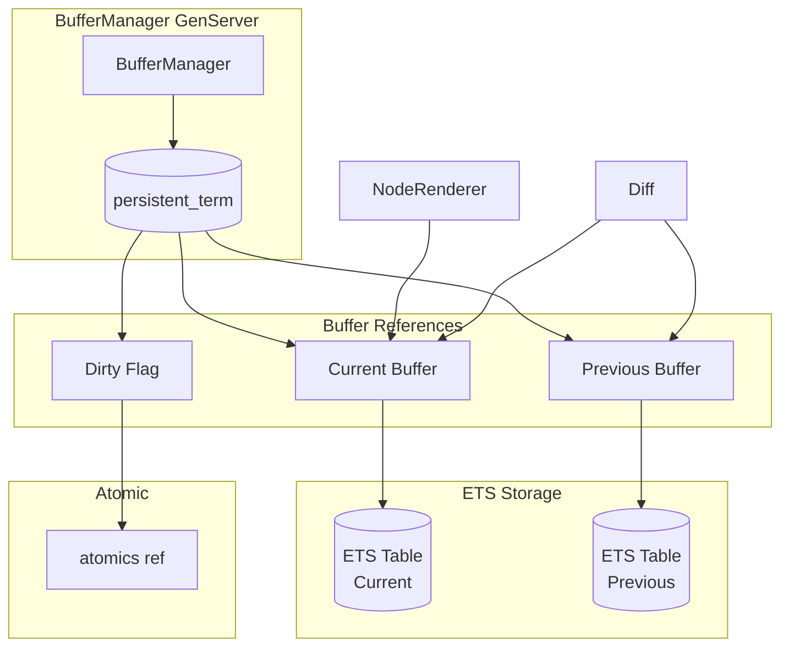
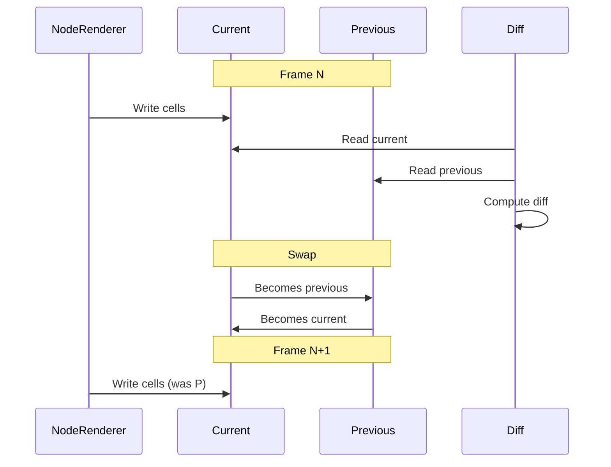
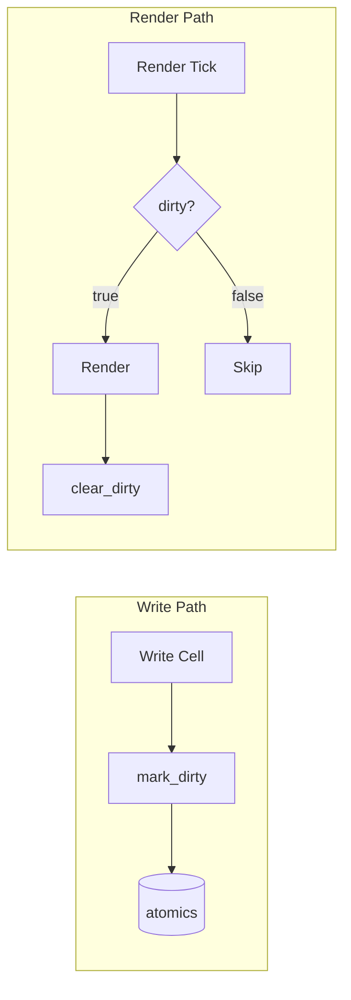

# Buffer Management

This guide explains TermUI's screen buffer system using ETS for efficient cell storage and double buffering for flicker-free updates.

## Architecture



## Buffer Structure

A Buffer wraps an ETS table:

```elixir
defmodule TermUI.Renderer.Buffer do
  defstruct [
    :table,  # ETS table reference
    :rows,   # Number of rows
    :cols    # Number of columns
  ]

  @type t :: %__MODULE__{
    table: :ets.tid(),
    rows: pos_integer(),
    cols: pos_integer()
  }
end
```

### Cell Storage

Cells are stored as `{{row, col}, cell}` tuples:

```elixir
# Cell at row 5, column 10
:ets.insert(buffer.table, {{5, 10}, %Cell{char: "X", fg: :red}})

# Lookup
[{_, cell}] = :ets.lookup(buffer.table, {5, 10})
```

### ETS Configuration

```elixir
def new(rows, cols) do
  table = :ets.new(:screen_buffer, [
    :set,           # Key-value storage
    :public,        # Any process can read/write
    read_concurrency: true,  # Optimized for concurrent reads
    write_concurrency: true  # Optimized for concurrent writes
  ])

  # Initialize with empty cells
  buffer = %__MODULE__{table: table, rows: rows, cols: cols}
  clear(buffer)

  {:ok, buffer}
end
```

## Double Buffering

Two buffers swap roles each frame:



### BufferManager Implementation

```elixir
defmodule TermUI.Renderer.BufferManager do
  use GenServer

  def init(opts) do
    rows = Keyword.fetch!(opts, :rows)
    cols = Keyword.fetch!(opts, :cols)

    {:ok, current} = Buffer.new(rows, cols)
    {:ok, previous} = Buffer.new(rows, cols)

    # Dirty flag using atomics for lock-free access
    dirty = :atomics.new(1, signed: false)

    # Store in persistent_term for direct access
    :persistent_term.put({__MODULE__, :current}, current)
    :persistent_term.put({__MODULE__, :previous}, previous)
    :persistent_term.put({__MODULE__, :dirty}, dirty)

    {:ok, %{current: current, previous: previous, dirty: dirty}}
  end
end
```

### Buffer Swap

```elixir
def handle_call(:swap_buffers, _from, state) do
  # O(1) pointer swap
  new_state = %{state | current: state.previous, previous: state.current}

  # Update persistent_term references
  :persistent_term.put({__MODULE__, :current}, new_state.current)
  :persistent_term.put({__MODULE__, :previous}, new_state.previous)

  {:reply, :ok, new_state}
end
```

## Direct Access

Most buffer operations bypass the GenServer for performance:

```elixir
# These read from persistent_term (no GenServer call)
def get_current_buffer do
  :persistent_term.get({__MODULE__, :current})
end

def get_previous_buffer do
  :persistent_term.get({__MODULE__, :previous})
end

def dirty? do
  dirty = :persistent_term.get({__MODULE__, :dirty})
  :atomics.get(dirty, 1) == 1
end

def mark_dirty do
  dirty = :persistent_term.get({__MODULE__, :dirty})
  :atomics.put(dirty, 1, 1)
  :ok
end
```

## Buffer Operations

### Writing Cells

```elixir
def set_cell(buffer, row, col, cell) do
  if in_bounds?(buffer, row, col) do
    :ets.insert(buffer.table, {{row, col}, cell})
    :ok
  else
    {:error, :out_of_bounds}
  end
end

def set_cells(buffer, cells) do
  entries = Enum.map(cells, fn {row, col, cell} ->
    {{row, col}, cell}
  end)
  :ets.insert(buffer.table, entries)
  :ok
end
```

### Reading Cells

```elixir
def get_cell(buffer, row, col) do
  case :ets.lookup(buffer.table, {row, col}) do
    [{_, cell}] -> cell
    [] -> Cell.empty()
  end
end

def get_row(buffer, row) do
  # Match all cells in row
  pattern = {{row, :_}, :_}
  cells = :ets.match_object(buffer.table, pattern)

  # Sort by column and extract cells
  cells
  |> Enum.sort_by(fn {{_, col}, _} -> col end)
  |> Enum.map(fn {_, cell} -> cell end)
end
```

### Clearing

```elixir
def clear(buffer) do
  clear_region(buffer, 1, 1, buffer.cols, buffer.rows)
end

def clear_region(buffer, start_row, start_col, width, height) do
  empty = Cell.empty()

  entries =
    for row <- start_row..(start_row + height - 1),
        col <- start_col..(start_col + width - 1),
        in_bounds?(buffer, row, col) do
      {{row, col}, empty}
    end

  :ets.insert(buffer.table, entries)
  :ok
end
```

## Cell Structure

```elixir
defmodule TermUI.Renderer.Cell do
  defstruct [
    char: " ",           # Single grapheme
    fg: :default,        # Foreground color
    bg: :default,        # Background color
    attrs: MapSet.new(), # Text attributes
    width: 1,            # Display width (1 or 2)
    wide_placeholder: false
  ]
end
```

### Cell Comparison

Used by the diff algorithm:

```elixir
def equal?(a, b) do
  a.char == b.char and
  a.fg == b.fg and
  a.bg == b.bg and
  MapSet.equal?(a.attrs, b.attrs) and
  a.width == b.width and
  a.wide_placeholder == b.wide_placeholder
end
```

### Wide Characters

CJK and emoji characters take 2 cells:

```elixir
# Primary cell
primary = %Cell{char: "中", width: 2}

# Placeholder for second column
placeholder = %Cell{char: "", width: 0, wide_placeholder: true}

# Both must be written
:ets.insert(buffer.table, [
  {{row, col}, primary},
  {{row, col + 1}, placeholder}
])
```

## Dirty Flag

Tracks whether re-render is needed:



Using atomics for lock-free access:

```elixir
# Mark dirty (from any process)
def mark_dirty do
  dirty = :persistent_term.get({__MODULE__, :dirty})
  :atomics.put(dirty, 1, 1)
end

# Check dirty (from render loop)
def dirty? do
  dirty = :persistent_term.get({__MODULE__, :dirty})
  :atomics.get(dirty, 1) == 1
end

# Clear dirty (after render)
def clear_dirty do
  dirty = :persistent_term.get({__MODULE__, :dirty})
  :atomics.put(dirty, 1, 0)
end
```

## Resize Handling

```elixir
def handle_call({:resize, rows, cols}, _from, state) do
  # Create new buffers with new dimensions
  {:ok, new_current} = Buffer.resize(state.current, rows, cols)
  {:ok, new_previous} = Buffer.resize(state.previous, rows, cols)

  new_state = %{state | current: new_current, previous: new_previous}

  # Update persistent_term
  :persistent_term.put({__MODULE__, :current}, new_current)
  :persistent_term.put({__MODULE__, :previous}, new_previous)

  {:reply, :ok, new_state}
end
```

### Content Preservation

```elixir
def resize(buffer, new_rows, new_cols) do
  {:ok, new_buffer} = new(new_rows, new_cols)

  # Copy cells that fit in new dimensions
  old_entries = :ets.tab2list(buffer.table)

  entries_to_copy =
    old_entries
    |> Enum.filter(fn {{row, col}, _} ->
      row <= new_rows and col <= new_cols
    end)

  :ets.insert(new_buffer.table, entries_to_copy)

  # Clean up old table
  :ets.delete(buffer.table)

  {:ok, new_buffer}
end
```

## Performance Characteristics

| Operation | Complexity | Notes |
|-----------|------------|-------|
| `get_cell` | O(1) | ETS hash lookup |
| `set_cell` | O(1) | ETS insert |
| `set_cells` | O(n) | Batch insert |
| `get_row` | O(cols) | Match + sort |
| `clear` | O(rows × cols) | Full buffer |
| `swap_buffers` | O(1) | Pointer swap |
| `dirty?` | O(1) | Atomic read |

## Memory Usage

Each cell: ~100-200 bytes depending on content

For 80×24 terminal: ~200KB per buffer (400KB total)
For 200×50 terminal: ~2MB per buffer (4MB total)

## Cleanup

```elixir
def terminate(_reason, state) do
  # Remove persistent_term entries
  :persistent_term.erase({__MODULE__, :current})
  :persistent_term.erase({__MODULE__, :previous})
  :persistent_term.erase({__MODULE__, :dirty})

  # Delete ETS tables
  Buffer.destroy(state.current)
  Buffer.destroy(state.previous)

  :ok
end

# Buffer.destroy/1
def destroy(buffer) do
  :ets.delete(buffer.table)
end
```

## Next Steps

- [Rendering Pipeline](03-rendering-pipeline.md) - How buffers are used
- [Terminal Layer](06-terminal-layer.md) - Output to terminal
- [Architecture Overview](01-architecture-overview.md) - System context
