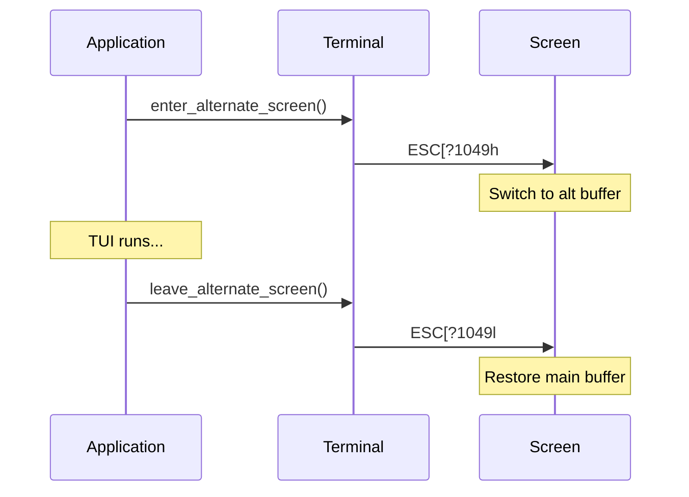

# Terminal Layer

This guide covers TermUI's low-level terminal interface, including raw mode, escape sequences, and platform handling.

## Components

```mermaid
graph TB
    subgraph "Terminal Layer"
        TG[Terminal GenServer]
        IR[InputReader]
        EP[EscapeParser]
        ANSI[ANSI Module]
    end

    subgraph "System"
        TTY[/dev/tty]
        STDIN[stdin]
        STDOUT[stdout]
    end

    TG --> TTY
    TG --> STDOUT
    IR --> STDIN
    IR --> EP
    ANSI --> TG
```

## Terminal GenServer

`TermUI.Terminal` manages terminal state:

```elixir
defmodule TermUI.Terminal do
  use GenServer

  defstruct [
    :original_mode,      # Saved terminal state
    :raw_mode_enabled,   # Currently in raw mode?
    :mouse_mode,         # Mouse tracking mode
    :resize_callbacks    # Processes to notify on resize
  ]
end
```

### Initialization

```elixir
def init(_opts) do
  state = %__MODULE__{
    original_mode: nil,
    raw_mode_enabled: false,
    mouse_mode: nil,
    resize_callbacks: []
  }
  {:ok, state}
end
```

## Raw Mode

### Enabling Raw Mode

OTP 28+ uses the native shell API:

```elixir
def enable_raw_mode do
  if terminal?() do
    # OTP 28+ native raw mode
    :shell.start_interactive({:noshell, :raw})
    :ok
  else
    {:error, :not_a_terminal}
  end
end
```

### Terminal Detection

Multiple methods for SSH compatibility:

```elixir
defp terminal? do
  cond do
    io_has_terminal?() -> true
    File.exists?("/dev/tty") -> true
    check_tty() -> true
    true -> false
  end
end

defp io_has_terminal? do
  case :io.getopts(:standard_io) do
    {:ok, opts} -> Keyword.get(opts, :terminal, false) == true
    _ -> false
  end
end

defp check_tty do
  case System.cmd("test", ["-t", "0"], stderr_to_stdout: true) do
    {_, 0} -> true
    _ -> false
  end
rescue
  _ -> false
end
```

### Restoring Terminal

```elixir
def restore do
  # Disable raw mode
  disable_raw_mode()

  # Leave alternate screen
  leave_alternate_screen()

  # Show cursor
  show_cursor()

  # Disable mouse tracking
  disable_mouse_tracking()

  # Reset all attributes
  write_to_terminal("\e[0m")

  :ok
end
```

## Escape Sequences

### ANSI Module

`TermUI.ANSI` generates escape sequences:

```elixir
defmodule TermUI.ANSI do
  # Cursor movement
  def cursor_position(row, col), do: "\e[#{row};#{col}H"
  def cursor_up(n \\ 1), do: "\e[#{n}A"
  def cursor_down(n \\ 1), do: "\e[#{n}B"
  def cursor_forward(n \\ 1), do: "\e[#{n}C"
  def cursor_back(n \\ 1), do: "\e[#{n}D"

  # Cursor visibility
  def hide_cursor, do: "\e[?25l"
  def show_cursor, do: "\e[?25h"

  # Screen control
  def clear_screen, do: "\e[2J"
  def clear_line, do: "\e[2K"
  def enter_alternate_screen, do: "\e[?1049h"
  def leave_alternate_screen, do: "\e[?1049l"

  # Style reset
  def reset, do: "\e[0m"
end
```

### SGR (Select Graphic Rendition)

Text styling sequences:

```elixir
# Colors
defp color_to_sgr(:fg, :default), do: "39"
defp color_to_sgr(:fg, :black), do: "30"
defp color_to_sgr(:fg, :red), do: "31"
defp color_to_sgr(:fg, :green), do: "32"
# ... etc

defp color_to_sgr(:bg, :default), do: "49"
defp color_to_sgr(:bg, :black), do: "40"
# ... etc

# 256 colors
defp color_to_sgr(:fg, n) when is_integer(n), do: "38;5;#{n}"
defp color_to_sgr(:bg, n) when is_integer(n), do: "48;5;#{n}"

# True color
defp color_to_sgr(:fg, {r, g, b}), do: "38;2;#{r};#{g};#{b}"
defp color_to_sgr(:bg, {r, g, b}), do: "48;2;#{r};#{g};#{b}"

# Attributes
defp attr_to_sgr(:bold), do: "1"
defp attr_to_sgr(:dim), do: "2"
defp attr_to_sgr(:italic), do: "3"
defp attr_to_sgr(:underline), do: "4"
defp attr_to_sgr(:blink), do: "5"
defp attr_to_sgr(:reverse), do: "7"
defp attr_to_sgr(:hidden), do: "8"
defp attr_to_sgr(:strikethrough), do: "9"

# Attribute off
defp attr_off_sgr(:bold), do: "22"
defp attr_off_sgr(:underline), do: "24"
# ... etc
```

### Sequence Buffer

Batches sequences for efficient output:

```elixir
defmodule TermUI.Renderer.SequenceBuffer do
  defstruct [
    buffer: [],          # Accumulated iodata
    size: 0,             # Current size
    threshold: 4096,     # Auto-flush threshold
    last_style: nil      # For delta encoding
  ]

  def append(buffer, data) do
    new_size = buffer.size + IO.iodata_length(data)
    new_buffer = %{buffer | buffer: [data | buffer.buffer], size: new_size}

    if new_size >= buffer.threshold do
      {flushed, reset} = flush(new_buffer)
      {:flush, flushed, reset}
    else
      {:ok, new_buffer}
    end
  end

  def flush(buffer) do
    data = buffer.buffer |> Enum.reverse()
    {data, %{buffer | buffer: [], size: 0}}
  end
end
```

### Style Delta Encoding

Only emit changed attributes:

```elixir
def append_style(buffer, style) do
  params = style_to_sgr_params(style, buffer.last_style)

  if params == [] do
    buffer
  else
    sequence = build_sgr_sequence(params)
    buffer = append!(buffer, sequence)
    %{buffer | last_style: style}
  end
end

defp style_to_sgr_params(style, nil) do
  # No previous - emit all
  build_full_sgr_params(style)
end

defp style_to_sgr_params(style, last) do
  params = []

  # Only emit if changed
  params = if style.fg != last.fg do
    fg = style.fg || :default
    [color_to_sgr(:fg, fg) | params]
  else
    params
  end

  params = if style.bg != last.bg do
    bg = style.bg || :default
    [color_to_sgr(:bg, bg) | params]
  else
    params
  end

  # Handle attribute changes...
  params
end
```

## Mouse Tracking

### Modes

```elixir
def enable_mouse_tracking(mode) do
  sequences = case mode do
    :click ->
      # X11 mouse button events
      ["\e[?1000h", "\e[?1006h"]

    :drag ->
      # Button events + motion while pressed
      ["\e[?1002h", "\e[?1006h"]

    :all ->
      # All mouse events including motion
      ["\e[?1003h", "\e[?1006h"]
  end

  Enum.each(sequences, &write_to_terminal/1)
  :ok
end

def disable_mouse_tracking do
  sequences = [
    "\e[?1000l",  # Disable X11
    "\e[?1002l",  # Disable drag
    "\e[?1003l",  # Disable all
    "\e[?1006l"   # Disable SGR
  ]
  Enum.each(sequences, &write_to_terminal/1)
  :ok
end
```

### SGR Mouse Format

More precise than X10 format:

```
ESC [ < Cb ; Cx ; Cy M    (button press)
ESC [ < Cb ; Cx ; Cy m    (button release)

Cb = button info (bits encode button, modifiers, motion)
Cx = column (1-indexed)
Cy = row (1-indexed)
```

## Focus Events

```elixir
def enable_focus_events do
  write_to_terminal("\e[?1004h")
end

def disable_focus_events do
  write_to_terminal("\e[?1004l")
end

# Terminal sends:
# \e[I  - Focus gained
# \e[O  - Focus lost
```

## Terminal Size

### Query Size

```elixir
def get_terminal_size do
  case :io.columns() do
    {:ok, cols} ->
      case :io.rows() do
        {:ok, rows} -> {:ok, {rows, cols}}
        _ -> {:error, :unknown}
      end
    _ ->
      {:error, :unknown}
  end
end
```

### Resize Detection

```elixir
# Register for SIGWINCH
def register_resize_callback(pid) do
  GenServer.cast(__MODULE__, {:register_resize, pid})
end

# On resize signal
def handle_info(:sigwinch, state) do
  case get_terminal_size() do
    {:ok, {rows, cols}} ->
      # Notify all registered processes
      Enum.each(state.resize_callbacks, fn pid ->
        send(pid, {:terminal_resize, {rows, cols}})
      end)
    _ ->
      :ok
  end
  {:noreply, state}
end
```

## Alternate Screen



```elixir
def enter_alternate_screen do
  write_to_terminal("\e[?1049h")
end

def leave_alternate_screen do
  write_to_terminal("\e[?1049l")
end
```

## Bracketed Paste

```elixir
def enable_bracketed_paste do
  write_to_terminal("\e[?2004h")
end

def disable_bracketed_paste do
  write_to_terminal("\e[?2004l")
end

# Pasted text arrives as:
# \e[200~ <paste content> \e[201~
```

## Platform Differences

### Unix/Linux/macOS

- `/dev/tty` for terminal access
- `stty` for fallback mode control
- SIGWINCH for resize detection

### Windows

- ConPTY for modern terminals
- Different escape sequence support
- Windows Terminal provides full ANSI support

```elixir
defp platform do
  case :os.type() do
    {:unix, _} -> :unix
    {:win32, _} -> :windows
  end
end
```

## Error Recovery

### Terminal Restoration

Always restore on exit:

```elixir
def terminate(_reason, state) do
  # Best-effort restoration
  try do
    restore()
  rescue
    _ -> :ok
  end
  :ok
end
```

### Crash Recovery

The runtime traps exits:

```elixir
def init(opts) do
  Process.flag(:trap_exit, true)
  # ...
end

def terminate(_reason, state) do
  # Terminal.restore() always called
  if state.terminal_started do
    Terminal.restore()
  end
  :ok
end
```

## Debugging

### Raw Escape Sequences

```elixir
# See actual bytes
IO.inspect(data, binaries: :as_binaries)

# Example output:
# <<27, 91, 49, 59, 51, 49, 109>>
# = ESC [ 1 ; 3 1 m
# = bold + red foreground
```

### Terminal State

```elixir
# Check if in raw mode
:io.getopts(:standard_io)
# => {:ok, [terminal: true, ...]}
```

## Next Steps

- [Event System](04-event-system.md) - Input parsing
- [Rendering Pipeline](03-rendering-pipeline.md) - Output flow
- [Buffer Management](05-buffer-management.md) - Screen buffers
