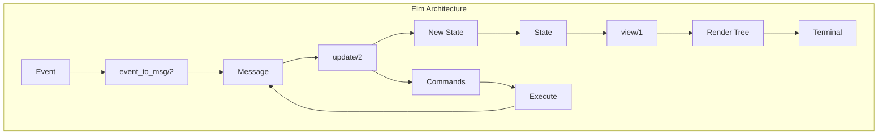
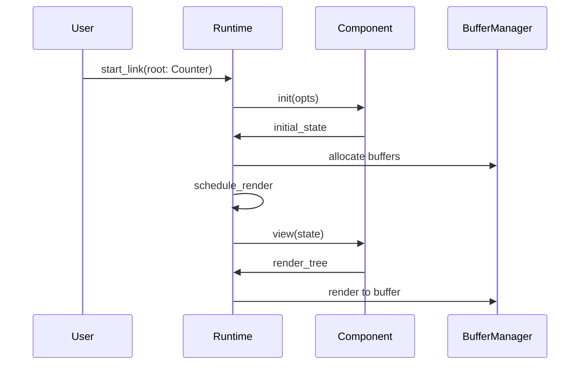
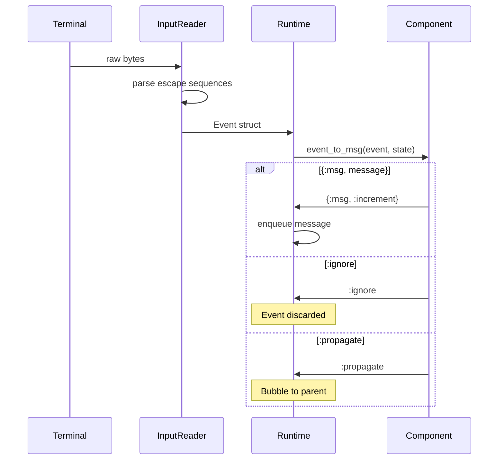
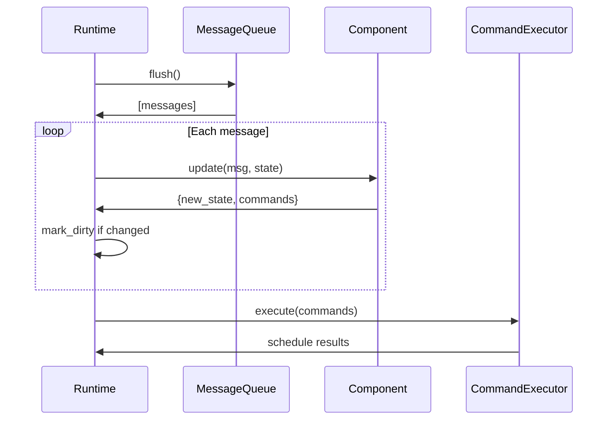
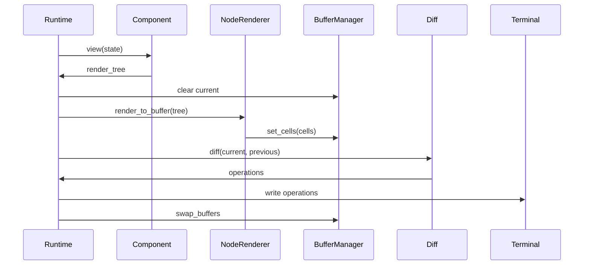

# Elm Architecture Implementation

This guide explains how TermUI implements The Elm Architecture (TEA) pattern adapted for OTP/Elixir.

## The Pattern



## Component Behaviour

Every TermUI component implements the `TermUI.Component` behaviour:

```elixir
defmodule TermUI.Component do
  @callback init(opts :: keyword()) :: state :: term()
  @callback event_to_msg(event :: Event.t(), state :: term()) ::
              {:msg, msg :: term()} | :ignore | :propagate
  @callback update(msg :: term(), state :: term()) ::
              {new_state :: term(), commands :: [command()]}
  @callback view(state :: term()) :: render_tree :: term()
end
```

### Example Component

```elixir
defmodule Counter do
  @behaviour TermUI.Component

  import TermUI.View
  alias TermUI.Event

  # Initialize state
  @impl true
  def init(_opts), do: %{count: 0}

  # Convert events to messages
  @impl true
  def event_to_msg(%Event.Key{key: :up}, _state), do: {:msg, :increment}
  def event_to_msg(%Event.Key{key: :down}, _state), do: {:msg, :decrement}
  def event_to_msg(%Event.Key{key: "q"}, _state), do: {:msg, :quit}
  def event_to_msg(_event, _state), do: :ignore

  # Update state based on messages
  @impl true
  def update(:increment, state), do: {%{state | count: state.count + 1}, []}
  def update(:decrement, state), do: {%{state | count: state.count - 1}, []}
  def update(:quit, state), do: {state, [:quit]}

  # Render current state
  @impl true
  def view(state) do
    stack(:vertical, [
      text("Counter: #{state.count}"),
      text("↑/↓ to change, q to quit")
    ])
  end
end
```

## Data Flow

### 1. Init Phase



```elixir
# Runtime.init/1
def init(opts) do
  root_module = Keyword.fetch!(opts, :root)

  # Call component's init
  root_state = root_module.init(opts)

  state = %State{
    root_module: root_module,
    root_state: root_state,
    # ...
  }

  # Schedule first render
  schedule_render(state.render_interval)

  {:ok, state}
end
```

### 2. Event Phase



```elixir
# Runtime handles input from InputReader
def handle_info({:input, event}, state) do
  state = dispatch_event(event, state)
  {:noreply, state}
end

defp dispatch_event(event, state) do
  case state.root_module.event_to_msg(event, state.root_state) do
    {:msg, message} ->
      enqueue_message(:root, message, state)

    :ignore ->
      state

    :propagate ->
      # Future: bubble to parent component
      state
  end
end
```

### 3. Update Phase



```elixir
defp process_messages(state) do
  {messages, queue} = MessageQueue.flush(state.message_queue)

  {state, all_commands} =
    Enum.reduce(messages, {state, []}, fn {component_id, msg}, {acc, cmds} ->
      {new_state, new_cmds} = process_single_message(component_id, msg, acc)
      {new_state, cmds ++ new_cmds}
    end)

  execute_commands(all_commands, %{state | message_queue: queue})
end

defp process_single_message(:root, msg, state) do
  {new_root_state, commands} = state.root_module.update(msg, state.root_state)

  dirty = state.dirty or new_root_state != state.root_state

  {%{state | root_state: new_root_state, dirty: dirty}, commands}
end
```

### 4. View Phase



```elixir
defp do_render(state) do
  # 1. Get render tree
  render_tree = state.root_module.view(state.root_state)

  # 2. Clear and render to buffer
  BufferManager.clear_current()
  NodeRenderer.render_to_buffer(render_tree)

  # 3. Diff against previous
  current = BufferManager.get_current_buffer()
  previous = BufferManager.get_previous_buffer()
  operations = Diff.diff(current, previous)

  # 4. Output to terminal
  render_operations(operations)

  # 5. Swap buffers for next frame
  BufferManager.swap_buffers()

  %{state | dirty: false}
end
```

## Commands

Commands are side effects returned from `update/2`:

```mermaid
graph LR
    subgraph "Command Types"
        Q[:quit] --> Shutdown
        T[{:timer, ms, msg}] --> TimerProcess
        A[{:async, fun, msg}] --> TaskProcess
    end

    TimerProcess --> MQ[MessageQueue]
    TaskProcess --> MQ
```

### Built-in Commands

```elixir
# Quit application
def update(:quit, state), do: {state, [:quit]}

# Set timer
def update(:start_timer, state) do
  {state, [{:timer, 1000, :tick}]}
end

# Async operation
def update(:fetch_data, state) do
  task = fn -> HTTP.get!("/api/data") end
  {state, [{:async, task, :data_received}]}
end
```

### Command Execution

```elixir
defp execute_commands(commands, state) do
  Enum.reduce(commands, state, fn cmd, acc ->
    execute_command(cmd, acc)
  end)
end

defp execute_command(:quit, state) do
  GenServer.cast(self(), :shutdown)
  %{state | shutting_down: true}
end

defp execute_command({:timer, ms, msg}, state) do
  command_id = make_ref()
  Process.send_after(self(), {:command_result, :root, command_id, msg}, ms)

  pending = Map.put(state.pending_commands, command_id, {:timer, msg})
  %{state | pending_commands: pending}
end

defp execute_command({:async, fun, msg_wrapper}, state) do
  command_id = make_ref()
  parent = self()

  Task.start(fn ->
    result = fun.()
    send(parent, {:command_result, :root, command_id, {msg_wrapper, result}})
  end)

  pending = Map.put(state.pending_commands, command_id, {:async, msg_wrapper})
  %{state | pending_commands: pending}
end
```

### Command Results

```elixir
def handle_info({:command_result, component_id, cmd_id, result}, state) do
  state = %{state | pending_commands: Map.delete(state.pending_commands, cmd_id)}
  state = enqueue_message(component_id, result, state)
  {:noreply, state}
end
```

## Message Queue

FIFO ordering with component targeting:

```elixir
defmodule TermUI.Runtime.MessageQueue do
  defstruct queue: :queue.new()

  def enqueue(mq, component_id, message) do
    %{mq | queue: :queue.in({component_id, message}, mq.queue)}
  end

  def flush(mq) do
    messages = :queue.to_list(mq.queue)
    {messages, %{mq | queue: :queue.new()}}
  end

  def empty?(mq) do
    :queue.is_empty(mq.queue)
  end
end
```

## Render Tree Nodes

The `view/1` function returns a tree of render nodes:

```elixir
# Text with optional style
{:text, "Hello", %Style{fg: :red}}

# Vertical or horizontal stack
{:stack, :vertical, [child1, child2]}
{:stack, :horizontal, [child1, child2]}

# Style wrapper
{:styled, %Style{bg: :blue}, child}

# Fragment (no container)
{:fragment, [child1, child2, child3]}

# Raw cells
{:cells, [%Cell{char: "█", fg: :green}, ...]}
```

### View Helpers

```elixir
defmodule TermUI.View do
  def text(content), do: {:text, content, Style.new()}
  def text(content, style), do: {:text, content, style}

  def stack(direction, children) when direction in [:vertical, :horizontal] do
    {:stack, direction, List.flatten(children)}
  end

  def styled(style, child), do: {:styled, style, child}

  def fragment(children), do: {:fragment, List.flatten(children)}
end
```

## State Immutability

All state updates create new values:

```elixir
# Good - create new state
def update(:increment, state) do
  {%{state | count: state.count + 1}, []}
end

# Bad - mutation (doesn't work in Elixir anyway)
def update(:increment, state) do
  state.count = state.count + 1  # Compile error!
  {state, []}
end
```

### Nested State Updates

```elixir
def update({:set_user_name, name}, state) do
  # Update nested map
  new_user = %{state.user | name: name}
  {%{state | user: new_user}, []}
end

# Or with put_in
def update({:set_user_name, name}, state) do
  {put_in(state, [:user, :name], name), []}
end
```

## Error Handling

Components are wrapped in error protection:

```elixir
defp safe_event_to_msg(module, event, state) do
  try do
    module.event_to_msg(event, state)
  rescue
    error ->
      Logger.error("event_to_msg crashed: #{inspect(error)}")
      :ignore
  end
end

defp safe_update(module, msg, state) do
  try do
    module.update(msg, state)
  rescue
    error ->
      Logger.error("update crashed: #{inspect(error)}")
      {state, []}
  end
end

defp safe_view(module, state) do
  try do
    module.view(state)
  rescue
    error ->
      Logger.error("view crashed: #{inspect(error)}")
      {:text, "[Render Error]", Style.new(fg: :red)}
  end
end
```

## Comparison with Original Elm

| Aspect | Elm | TermUI |
|--------|-----|--------|
| Language | Elm (ML-style) | Elixir |
| Runtime | Browser/JavaScript | BEAM/OTP |
| Model | `Model` type | Component state (any term) |
| Msg | `Msg` union type | Any Elixir term |
| Cmd | `Cmd Msg` | List of command tuples |
| Sub | `Sub Msg` | Commands + Input events |
| view | Virtual DOM | Render tree |
| update | Pure function | Pure function |
| Side effects | Elm runtime | Runtime + Commands |

### Key Differences

1. **No subscriptions**: TermUI uses commands and the InputReader instead
2. **Commands as data**: Commands are simple tuples, not opaque types
3. **event_to_msg**: Additional callback to separate event parsing from state updates
4. **Process model**: Components could be separate processes (future)

## Testing Components

```elixir
defmodule CounterTest do
  use ExUnit.Case

  alias TermUI.Event

  test "init returns zero count" do
    assert Counter.init([]) == %{count: 0}
  end

  test "up arrow increments" do
    state = %{count: 5}
    event = Event.key(:up)

    assert {:msg, :increment} = Counter.event_to_msg(event, state)

    {new_state, commands} = Counter.update(:increment, state)
    assert new_state.count == 6
    assert commands == []
  end

  test "quit returns quit command" do
    state = %{count: 0}

    {^state, commands} = Counter.update(:quit, state)
    assert :quit in commands
  end

  test "view renders count" do
    state = %{count: 42}
    tree = Counter.view(state)

    # Inspect tree structure
    {:stack, :vertical, [text_node | _]} = tree
    {:text, content, _style} = text_node
    assert content =~ "42"
  end
end
```

## Best Practices

### 1. Keep State Minimal

```elixir
# Good - only essential data
%{
  items: [...],
  selected_index: 0,
  filter: ""
}

# Avoid - derived data in state
%{
  items: [...],
  filtered_items: [...],  # Derive in view instead
  item_count: 10          # Derive from items
}
```

### 2. Use Pattern Matching in event_to_msg

```elixir
# Good - specific patterns
def event_to_msg(%Event.Key{key: :enter}, _state), do: {:msg, :submit}
def event_to_msg(%Event.Key{key: :escape}, _state), do: {:msg, :cancel}
def event_to_msg(%Event.Key{key: key}, _state) when key in ["q", "Q"], do: {:msg, :quit}
def event_to_msg(_event, _state), do: :ignore

# Avoid - complex logic in event_to_msg
def event_to_msg(event, state) do
  cond do
    event.key == :enter and state.mode == :edit -> {:msg, :save}
    event.key == :enter and state.mode == :view -> {:msg, :edit}
    # ... many conditions
  end
end
```

### 3. Messages as Intent

```elixir
# Good - messages describe intent
:increment
:decrement
{:select_item, index}
{:set_filter, text}

# Avoid - messages that are too low-level
{:set_count, 5}  # Doesn't express why
{:keypress, :up}  # Already handled by event_to_msg
```

### 4. Commands for Side Effects

```elixir
# Good - side effects via commands
def update(:refresh, state) do
  {%{state | loading: true}, [{:async, &fetch_data/0, :data_loaded}]}
end

# Avoid - side effects in update
def update(:refresh, state) do
  data = HTTP.get!("/api")  # Blocks, can crash
  {%{state | data: data}, []}
end
```

## Next Steps

- [Architecture Overview](01-architecture-overview.md) - System layers
- [Runtime Internals](02-runtime-internals.md) - Event loop details
- [Event System](04-event-system.md) - Input handling
