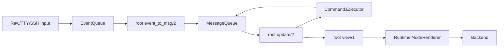

# Developer Guides

These guides describe the code shipped in TermUI 1.0. The most important
boundary is that the main application path is a single-root Elm runtime.
TermUI also ships lower-level process-oriented component services, but the
runtime does not automatically start, register, render, or route through them.

## Reading order

1. [Architecture Overview](01-architecture-overview.md)
2. [Runtime Internals](02-runtime-internals.md)
3. [Rendering Pipeline](03-rendering-pipeline.md)
4. [Event System](04-event-system.md)
5. [Buffer Management](05-buffer-management.md)
6. [Terminal Layer](06-terminal-layer.md)
7. [Elm Implementation](07-elm-implementation.md)
8. [Creating Widgets](08-creating-widgets.md)
9. [Testing Framework](09-testing-framework.md)

## Integrated application path

`TermUI.Runtime` owns the root state and render loop. Stateful widgets are
embedded state machines: the root initializes their state, forwards events,
and renders them. Stateless widgets are called directly from `view/1`.

## Optional component services

`TermUI.ComponentServer`, `TermUI.ComponentSupervisor`,
`TermUI.ComponentRegistry`, `TermUI.EventRouter`, `TermUI.FocusManager`,
`TermUI.SpatialIndex`, and `TermUI.Component.StatePersistence` form a separate
toolkit for process-oriented component lifecycles. They are public, but they do
not constitute the default runtime's component tree in 1.0.
