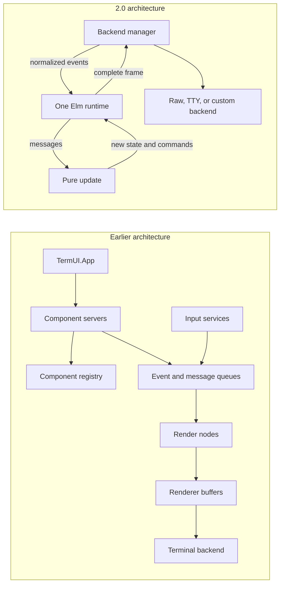
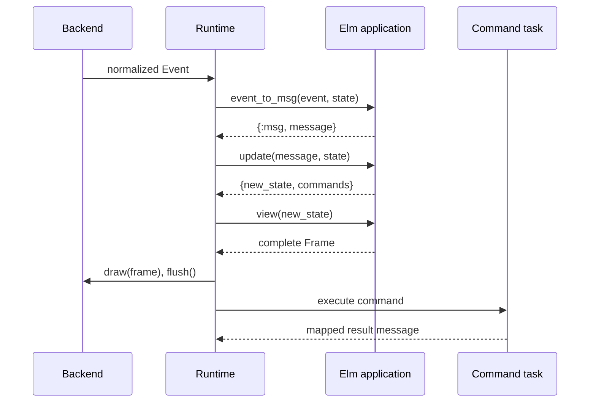
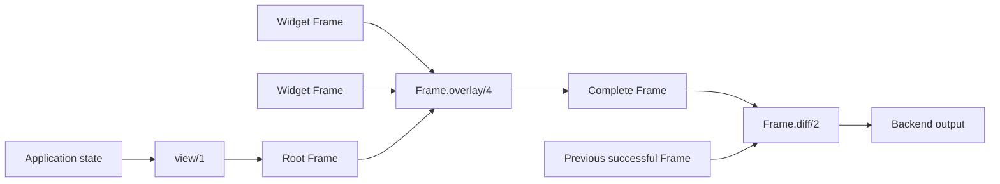

# TermUI redesign for 2.0

## Status and scope

This document describes the architecture introduced by
[pull request #41](https://github.com/pcharbon70/term_ui/pull/41) relative to
the `develop` branch at the time of review. The pull request currently labels
the package `1.0.0-rc.1`; this document uses “2.0” to describe the redesign
because its public API, ownership model, rendering contract, and extension
points are intentionally incompatible with the earlier release candidate.

This is a replacement of the framework core, not an incremental refactor. The
pull request changes 643 files, adds approximately 22,000 lines, removes
approximately 137,000 lines, and does not provide compatibility aliases for
the systems it removes.

The redesign is organized around six invariants:

1. One runtime owns one application state.
2. A backend owns the complete terminal session.
3. `TermUI.Frame` is the only application render value.
4. Widgets are pure state transitions owned by their parent application.
5. Effects are explicit `TermUI.Command` data.
6. External boundary data is validated while internal hot-path state remains
   lightweight.

## Architecture at a glance

The previous design distributed application behavior across component
processes, registries, queues, routers, render nodes, buffers, input services,
and terminal services. The redesign reduces this to one application owner and
one terminal owner.



The smaller process topology is intentional. Domain processes are still
appropriate for databases, network clients, subscriptions, or other business
concerns, but TermUI no longer creates a process for each UI component.

## 1. One application runtime replaces the component system

### Earlier model

The earlier implementation combined an Elm-style API with a component process
model. State could be spread across the root application, component servers,
component supervisors, a registry, containers, persistence helpers, event
queues, message queues, and a global focus manager. This offered many
extension points, but it also made event ordering, ownership, failure handling,
and terminal cleanup harder to reason about.

### 2.0 model

`TermUI.Runtime` is the only owner of application state. An application
implements `TermUI.Elm` and exposes the following callbacks:

| Callback | Responsibility |
| --- | --- |
| `init/1` | Create the initial state and optionally return initial commands. |
| `event_to_msg/2` | Convert a normalized terminal event into an application message or ignore it. |
| `update/2` | Produce the next state and optionally return commands. |
| `view/1` | Produce one complete `TermUI.Frame`. |
| `handle_info/2` | Convert an external BEAM message into state and commands. |
| `terminate/2` | Release application-owned resources. |

Applications start through `TermUI.run/2` for a blocking session or
`TermUI.start_link/2` when the runtime belongs in a supervision tree.
`TermUI.App`, `TermUI.Component`, `TermUI.StatefulComponent`, component
servers, registries, supervisors, containers, and component state persistence
are removed.

The runtime serializes:

- terminal events;
- application messages;
- command results;
- render scheduling;
- resize notifications;
- external process messages; and
- shutdown.

This creates one ordering boundary. An update cannot race with another update,
and the frame always represents a state that the runtime owns.



### Application impact

State formerly owned by a UI component must move into the root application
state or an ordinary domain process. The root application is responsible for
routing messages to the appropriate portion of its state. This is more
explicit, but it eliminates hidden component lifecycles and cross-component
coordination services.

## 2. `TermUI.Frame` becomes the only rendering representation

### Earlier model

Rendering previously passed through component render nodes, tuple nodes,
renderer buffers, a buffer manager, renderer-specific cell and style modules,
sequence buffers, and a node renderer. Several representations could describe
the same screen at different stages.

### 2.0 model

`TermUI.Frame` is the only value accepted from an application. A frame stores:

- a bounded width and height;
- a sparse map of positioned `TermUI.Cell` values;
- implicit blank cells for positions absent from the map; and
- an optional cursor.

The application can construct frames using `Frame.new/3`,
`Frame.from_rows/4`, cell writes, and row writes. Child frames are composed
with `Frame.overlay/4`. The backend compares the new frame with its last
successful frame using `Frame.diff/2` and emits only changed terminal cells.



Frames clip content to their dimensions. They understand terminal display
width rather than assuming that every grapheme occupies one cell. A wide
grapheme records a placeholder for its second column, and frame mutations
preserve or clear both cells together. A wide grapheme is not written when it
would begin in the final column.

The redesign also removes duplicate renderer namespaces:

- `TermUI.Renderer.Cell` becomes `TermUI.Cell`.
- `TermUI.Renderer.Style` becomes `TermUI.Style`.
- `TermUI.Component.RenderNode` and renderer buffers become `TermUI.Frame`.

There are several coordinate conventions to keep explicit:

- Application dimensions are `{columns, rows}`.
- Backend terminal sizes are `{rows, columns}`.
- Frame cell positions are `{row, column}` and one-based.
- Frame cursor positions are `{column, row}` and one-based.
- Mouse coordinates are `{x, y}` and zero-based.

Keeping these conversions at named boundaries is important; mixing them is an
easy source of resize, cursor, and mouse bugs.

## 3. Widgets become pure, parent-owned state

### Earlier model

The repository contained both `TermUI.Widget.*` and `TermUI.Widgets.*`
namespaces. Many advanced widgets owned processes, timers, subscriptions,
polling, callbacks, or GenStage consumers. Their state could live outside the
root application's update sequence.

### 2.0 model

The plural namespace is removed. Widgets live under `TermUI.Widget.*` and are
plain state plus functions:

```elixir
widget = TermUI.Widget.List.init(items: ["one", "two"])
{widget, messages} = TermUI.Widget.List.update(event, widget)
child_frame = TermUI.Widget.List.view(widget, {30, 10})
frame = TermUI.Frame.overlay(frame, child_frame, 2, 3)
```

The parent application owns the returned widget state, interprets widget
messages, executes effects through commands, and chooses where to place the
widget frame. The optional `mouse/3` callback receives local, zero-based
coordinates after the parent routes a global mouse event.

The redesigned catalog includes text inputs, text areas, Markdown and diff
viewers, lists, menus, tables, trees, forms, dialogs, panes, viewports, charts,
progress indicators, process snapshots, supervision snapshots, and cluster
snapshots. It also adds or formalizes controls such as checkbox, toggle, radio
group, select, spinner, and breadcrumb.

Widget names do not always imply complete behavioral parity with their former
process-backed versions:

| Area | 2.0 behavior | Behavior intentionally removed or deferred |
| --- | --- | --- |
| Table | Columns, scrolling, row replacement, keyboard and mouse selection | Built-in sorting and multi-selection |
| Menu | Flat actions, separators, disabled items, keyboard/mouse control | Nested submenu processes |
| Form | Text, checkbox, select, required checks, focus, and submit messages | General validator framework, field processes, and visibility groups |
| Toast | Pure bounded manager with explicit `tick/2` | Timer process and global toast service |
| Stream | Bounded batches, counters, pause/follow state, and overflow policies | Widget-owned GenStage consumer and rate service |
| Process and cluster views | Render snapshots supplied by the parent | Internal polling, monitoring, distributed RPC, and subscriptions |
| Split pane | Named panes, weights, collapse, resize, and local dragging | Automatic persistence service |
| Markdown | CommonMark-oriented terminal rendering and incremental documents | Required Makeup-based syntax highlighting |

The guiding rule is that reusable widgets remain pure. Polling, persistence,
RPC, subscriptions, and other effects live in the application or a dedicated
domain adapter.

## 4. Backends own the complete terminal session

### Backend contract

A backend now implements a complete session contract:

| Callback | Responsibility |
| --- | --- |
| `init/1` | Transactionally initialize the terminal session. |
| `size/1` | Return `{rows, columns}`. |
| `capabilities/1` | Report color, character-set, and other backend capabilities. |
| `draw/2` | Draw one complete `TermUI.Frame`. |
| `flush/1` | Flush pending terminal output. |
| `clipboard/2` | Optionally execute a serialized clipboard operation. |
| `poll_event/2` | Return a normalized event, timeout, or error. |
| `resize/2` | Update backend state for a new size. |
| `shutdown/2` | Restore the terminal and release resources. |

`TermUI.Backend.Manager` owns the selected backend state and serializes every
callback. State returned by input, drawing, flushing, clipboard operations,
and resizing becomes the state used by the next operation. The runtime never
looks inside backend state.

Initialization is intended to be transactional: a backend must undo partial
terminal changes when initialization fails. Once initialization succeeds,
every stop path is expected to call `shutdown/2`. An input failure requests a
final meaningful render before the application stops.

Size polling is integrated into the backend owner. Fast terminal or
environment checks default to a 200 ms interval, while `stty`-based detection
defaults to one second. Applications can configure the interval or disable
polling when a custom backend supplies resize events directly.

### Raw, TTY, and custom backends

The supported built-in modes are `:auto`, `:raw`, and `:tty`. `:auto` attempts
raw mode and falls back to TTY with detected capabilities. Tests and remote
integrations can inject a module or `{module, options}` tuple implementing the
backend behavior.

Raw and TTY therefore remain part of the redesign, but the old SSH backend is
removed. SSH should return only as a backend capable of owning input, output,
size, and cleanup for its complete remote terminal session.

### Known TTY follow-up work

The TTY path is functionally retained, but review identified three items that
should remain visible during the 2.0 rollout:

1. Explicit `backend: :tty` currently bypasses capability detection. In a
   constrained terminal such as `TERM=dumb` with an ASCII locale, it can assume
   Unicode and true color even though automatic TTY fallback correctly passes
   detected capabilities.
2. TTY no longer enables the alternate screen by default. It clears the
   primary screen, so the user's previous terminal content is not restored
   when the application exits. This must either be changed or documented as an
   intentional product decision.
3. Indexed colors can still emit 256-color escape sequences when capabilities
   report a 16-color terminal. This behavior already exists on `develop`, so
   it is not introduced by the redesign, but it remains a terminal correctness
   gap.

The first two items are regressions relative to the earlier top-level runtime
behavior. They are localized backend-manager/default issues rather than flaws
in the new backend contract.

## 5. Input events are redesigned

Backends now convert terminal bytes into a small set of public event structs:

| Event | Meaning |
| --- | --- |
| `TermUI.Event.Text` | Printable Unicode text |
| `TermUI.Event.Key` | Named keys or keys with modifiers |
| `TermUI.Event.Paste` | One bracketed-paste payload |
| `TermUI.Event.Mouse` | Press, release, move, drag, or scroll input |
| `TermUI.Event.Resize` | New application width and height |
| `TermUI.Event.Focus` | Terminal focus gained or lost |

Applications never parse terminal escape sequences. Printable input no longer
arrives through an `Event.Key.char` field; it arrives as `Event.Text`. Named
keys such as arrows and modified keys remain `Event.Key` values. This makes
multi-grapheme input, paste, and non-key terminal signals explicit.

The old `TermUI.Input.*`, line-reader, TTY server, terminal input reader, and
event transformation/router layers are removed. Input is owned by the selected
backend and flows directly to the one runtime.

Raw terminal behavior also gains a small C NIF. OTP's normal terminal handling
can consume flow-control and interrupt bytes before Elixir receives them. The
native layer changes the required terminal flags so Ctrl+O, Ctrl+C, Ctrl+S,
and Ctrl+Q reach the application, then restores the original flags during
shutdown.

## 6. Effects become typed command data

`TermUI.Command` replaces component-oriented effect tuples and the separate
command executor. An update returns either a new state or
`{new_state, commands}`.

| Command | Effect |
| --- | --- |
| `Command.message/1` | Queue a message for the application. |
| `Command.send/2` | Send a BEAM message to another process. |
| `Command.timer/2` | Deliver an application message after a delay. |
| `Command.async/2` | Run a zero-argument function outside the runtime process and map its result. |
| Clipboard command | Execute bounded clipboard output through the backend owner. |
| `Command.shutdown/1` | Request a final render and clean shutdown. |

Async result semantics are deliberately precise. A normal function return is
wrapped as `{:ok, value}`. A raise, throw, or exit is wrapped as
`{:error, reason}`. The mapper always receives exactly one runtime-produced
outer tag, so a function that returns `{:ok, value}` produces
`{:ok, {:ok, value}}` for the mapper.

Shutdown is a state transition rather than an abrupt process exit. The runtime
cancels a pending render timer, renders the newest dirty state, stops effect
tasks, calls the application's `terminate/2`, closes the backend owner, and
allows the backend to restore the terminal.

## 7. Global services are replaced with pure application data

The redesign removes global services and caches whose state could diverge from
the root application:

| Removed service | Pure replacement or new owner |
| --- | --- |
| Global focus manager and traversal groups | `TermUI.Focus` stored in application state |
| Shortcut sequence service | `TermUI.Shortcut` stored in application state |
| Global theme registry | `TermUI.Theme` values owned by the application |
| Mouse registry and spatial index | `TermUI.Mouse.Region` lists and `Mouse.Tracker` data |
| Constraint solver, alignment objects, and layout cache | Pure `TermUI.Layout` row, column, grid, inset, and placement functions |
| Global configuration and persistent-term caches | Runtime and widget options stored by their owner |

The new layout API allocates zero-based rectangles. Fixed tracks use integers,
while flexible tracks use `:fill` or weighted values. The application renders
child frames and places them into these rectangles. There is no global cache
or retained render tree.

This approach favors reproducibility over implicit convenience: application
state completely describes focus, shortcuts, theme selection, layout choices,
hover, and drag state.

## 8. Clipboard, selection, and mouse interaction are rebuilt

### Clipboard

Clipboard operations are bounded command data. The runtime sends them through
the backend manager so clipboard output stays ordered with frame output and
terminal cleanup. The built-in implementation uses OSC 52 and supports the
clipboard, primary, and secondary selections. Backends may decline clipboard
support through a structured error.

The default clipboard payload limit is 100,000 bytes. This prevents an
unbounded widget value from becoming unbounded terminal output.

### Selection

`TermUI.Selection` is pure Unicode-aware data. Positions are zero-based
grapheme offsets, and ranges are half-open. It supports forward and backward
ranges, word and line selection, select-all, extraction, and replacement.

Text input and text area use this model for Shift navigation, mouse dragging,
copy, cut, paste, Backspace, and Delete. Widgets emit data such as
`{:copy, text}`; the parent decides whether to turn that into a clipboard
command.

### Mouse routing

The application builds mouse regions from the same layout used to place
frames. `TermUI.Mouse.route/2` chooses the frontmost matching region and
translates the global event into local coordinates. The parent then calls the
target widget through `TermUI.Widget.mouse/4`.

Raw terminals leave mouse tracking disabled by default so normal terminal text
selection continues to work. Applications can opt into click, drag, or all
motion reporting according to their needs.

## 9. Streaming, Markdown, and diff rendering are rebuilt

### Bounded streaming

`TermUI.Widget.Stream` is pure bounded state with batch insertion, lifetime
counters, pause/follow behavior, scrolling, and explicit overflow policies:

- drop the oldest items;
- drop new items; or
- reject the whole incoming batch.

`TermUI.Stream.ProducerAdapter` provides an optional process boundary for an
external producer. It sends only one unacknowledged batch to the application
at a time. This prevents a slow UI from accumulating an unbounded series of
delivery messages. The application applies and acknowledges each batch in
update order.

### Incremental Markdown

Markdown rendering and streaming documents share one MDEx-based parser.
Completed top-level blocks are parsed once, while only the unfinished tail is
reparsed as new fragments arrive. The supported terminal rendering includes
headings, emphasis, strike-through, links, quotes, lists, tasks, code blocks,
rules, tables, autolinks, images, and terminal-safe handling of raw HTML.

Language labels and code-block selection remain, but optional lexer-based
syntax highlighting is deferred rather than keeping Makeup as a required
runtime dependency.

### Diff viewer

The redesign adds a dedicated diff viewer. It accepts before/after text or a
unified diff, bounds its input, performs line comparison, and renders unified
or side-by-side terminal views.

## 10. Public boundary data uses Zoi schemas

Zoi schemas define public data that crosses application, runtime, backend, or
configuration boundaries. This includes:

- cells and styles;
- frames;
- events;
- commands;
- clipboard operations;
- mouse regions;
- selections; and
- table columns.

These types expose `schema/0` for explicit validation. Schemas define struct
fields and defaults, enforce required keys, and validate nested invariants such
as frame bounds, cell width, colors, and command payload shapes.

Private runtime, backend, parser, stream-delivery, and widget state uses plain
structs. Constructors and guards protect internal hot paths without parsing
every frame mutation or widget update through Zoi. Applications are expected
to validate untrusted external data before constructing public boundary
values.

This split is important: schemas describe trust boundaries, not every piece of
internal data.

## 11. Package, dependency, and build requirements change

The pull request changes the package version from `1.0.0-rc` to
`1.0.0-rc.1`, while this design document proposes treating the contract as a
2.0 boundary.

Major package changes include:

- Elixir support changes from `~> 1.15` to `>= 1.18.4 and < 2.0.0`.
- The documented runtime requirement becomes Erlang/OTP 28 or later.
- Source installations require a C compiler and `make` or `nmake` for the
  terminal-control NIF.
- Zoi becomes the public boundary-schema dependency.
- MDEx is upgraded and becomes the shared Markdown parser.
- `elixir_make` is added for the native build.
- Runtime GenStage, Makeup, Makeup Elixir, and StreamData dependencies are
  removed.

The package adds Unix and Windows makefiles for the NIF, although operating
system behavior should still be verified independently from compilation.

The project quality alias now runs formatting, compilation with warnings as
errors, cross-reference cycle detection, strict Credo, Dialyzer, and Doctor.
Coverage has a 90 percent threshold. GitHub Actions moves to the shared Jido CI
and release workflows with an Elixir/OTP compatibility matrix.

## 12. Documentation, examples, and tests are replaced

The earlier repository had a large set of user and developer guides, a
separate application for nearly every widget, and a broad test suite coupled
to the old component and renderer internals.

The redesign removes those architecture-specific materials and introduces a
smaller documentation set focused on:

- the application/runtime architecture;
- the backend contract;
- pure widgets;
- clipboard, selection, and mouse interaction;
- Markdown and diffs;
- feature parity;
- removed and deferred features; and
- migration from the earlier release candidate.

The examples directory is consolidated from 28 applications to two maintained
examples: the IEx counter and a comprehensive interactive showcase. The
showcase exercises live data, inputs, controls, content, BEAM snapshots, and
the architecture in one testable application.

The test suite is also replaced rather than mechanically ported. Tests coupled
to component servers, registries, renderer buffers, old input services, and
process-backed widgets are removed. New tests focus on public contracts,
runtime sequencing, backend ownership, terminal lifecycle, frame invariants,
interaction behavior, widget boundaries, source conventions, and the
showcase. At the reviewed commit, the suite runs 879 tests and the project
enforces a 90 percent minimum coverage threshold.

Fewer test files should not be interpreted as compatibility with the previous
architecture. The new suite validates a smaller and different contract.

## Removed and deferred systems

The following systems are intentionally absent from the 2.0 core:

- component servers, registry, supervisor, containers, and component state
  persistence;
- event router, event queue, message queue, and global focus manager;
- legacy input modules and line readers;
- render nodes, renderer buffers, buffer managers, and duplicate renderer
  cell/style types;
- the plural process-backed widget namespace;
- global spatial index and mouse tracker services;
- global configuration and persistent-term caches;
- SSH backend support;
- global theme registry;
- constraint solver, alignment objects, and layout cache;
- hot reload, UI inspector, state inspector, and performance tools;
- component test harness, event simulator, and packaged test renderer; and
- dedicated Unix and Windows platform adapter modules.

Some capabilities may return later as optional pure APIs or complete backend
adapters. They should not reintroduce shared UI state or partial terminal
ownership.

## Public migration map

| Earlier API | 2.0 replacement |
| --- | --- |
| `TermUI.App` | `TermUI.run/2`, `TermUI.start_link/2`, or `TermUI.Runtime` |
| `TermUI.Component` and `TermUI.StatefulComponent` | One `TermUI.Elm` application or a pure `TermUI.Widget` |
| Component servers, registry, and supervisor | Root-owned state or a normal domain process |
| `TermUI.Component.RenderNode` | `TermUI.Frame` |
| Renderer buffers and tuple nodes | `TermUI.Frame` |
| `TermUI.Renderer.Cell` | `TermUI.Cell` |
| `TermUI.Renderer.Style` | `TermUI.Style` |
| `TermUI.Input.*` | The selected `TermUI.Backend` input callback |
| Printable `Event.Key.char` input | `TermUI.Event.Text` |
| Component effect tuples | `TermUI.Command` constructors |
| `TermUI.Widgets.*` | The matching pure module under `TermUI.Widget.*` |

A typical application migration requires these steps:

1. Select one root module and implement `TermUI.Elm`.
2. Move component-owned UI state into the root state.
3. Keep independent domain processes only where process ownership is useful
   outside the UI.
4. Convert terminal events to messages in `event_to_msg/2`.
5. Replace effect tuples with command structs.
6. Replace render nodes and buffers with a complete `TermUI.Frame`.
7. Handle `Event.Resize` and store the new `{columns, rows}` dimensions.
8. Convert widget modules from the plural namespace and store their returned
   state in the parent.
9. Move widget polling, timers, persistence, RPC, and subscriptions into the
   parent application or domain adapters.
10. Start the application with `TermUI.run/2` or `TermUI.start_link/2`.

Because there are no compatibility aliases, this migration must be performed
as an application-level change rather than a dependency-only upgrade.

## Recommended 2.0 acceptance criteria

Before publishing the redesigned contract as a stable release:

- forced `backend: :tty` should use detected capabilities unless explicitly
  overridden;
- alternate-screen behavior should be restored or documented as an intentional
  TTY policy;
- raw and TTY sessions should be smoke-tested in real pseudo-terminals for
  input, resize, final render, and terminal restoration;
- ASCII, monochrome, 16-color, 256-color, and true-color output should each
  have an explicit degradation test;
- custom backend contract tests should cover transactional initialization,
  state threading, optional clipboard support, input failure, and idempotent
  cleanup;
- the migration guide should be included in the published documentation; and
- deferred feature gaps should remain explicit so widget-name parity is not
  mistaken for behavior parity.

## Conclusion

The 2.0 design trades a broad, process-heavy framework for a smaller and more
deterministic terminal runtime. The central benefit is ownership clarity: one
process owns application state, one backend owner controls the terminal, one
frame represents the screen, and effects cross the runtime as explicit data.

That clarity comes with a real migration cost. Existing applications must
replace component processes, render nodes, old events, effect tuples, and
process-backed widget assumptions. Several global services and advanced widget
behaviors are intentionally deferred. Treating this as a major-version design
boundary makes those tradeoffs visible and gives applications an honest basis
for migration and testing.
