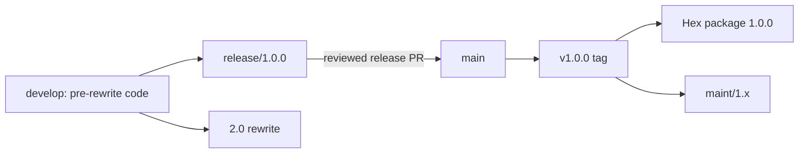

# TermUI 1.0.0 release runbook

## Purpose

This runbook describes how to stabilize the pre-rewrite TermUI code, merge it
into `main`, tag the exact release commit as `v1.0.0`, and publish that commit
to Hex as `1.0.0`.

The release should follow this topology:



A tag is not pushed “to” a branch. The `v1.0.0` tag must point to the exact
approved commit on `main`. Hex should then be published from a clean checkout
of that tag, not from an arbitrary or dirty `main` working tree.

## Repository snapshot when this runbook was written

At the time of writing:

- `develop` and `origin/develop` point to commit `1a82ab8bcaa2`.
- `main` is an ancestor of and 64 commits behind `develop`.
- `mix.exs` declares version `1.0.0-rc`.
- Hex has published `1.0.0-rc`, but not stable `1.0.0`.
- Pull request #41 contains the incompatible rewrite and is not merged.
- `re-design-for-2.0.md` and this release runbook are local, untracked
  documents.
- A full local pre-rewrite test run compiled successfully but reported test
  failures, including non-TTY `safe_stty` behavior and environment-sensitive
  ASCII fallback assertions.

Re-run every status and validation command below. Do not assume this snapshot
is still current when performing the release.

## Release-branch execution status (2026-08-26)

The `release/1.0.0` branch was created from `origin/develop` at `4c70486`.
The release stabilization work makes the following dispositions for the open
terminal and rendering reports:

| Item | 1.0 disposition |
|---|---|
| [PR #33](https://github.com/pcharbon70/term_ui/pull/33) SSH runtime integration | Reconciled. Concurrent SSH runtimes now own distinct buffer managers, custom sessions do not overwrite local terminal global state, SSH cursor gaps/display widths are correct, and teardown restores autowrap. The current cell-diff renderer explicitly emits erase cells for stale content, superseding the PR's full-row redraw path, and safely renders the bottom-right cell with autowrap disabled. |
| [#35](https://github.com/pcharbon70/term_ui/issues/35) macOS Option+Delete | Fixed. `ESC DEL` and `ESC BS` parse as Alt+Backspace in both Raw and TTY input paths, and text inputs delete the preceding word. |
| [#11](https://github.com/pcharbon70/term_ui/issues/11) layout constraints not rendered | Fixed. Documented `{node, constraint}` stack children are allocated and clipped by the layout solver. |
| [#25](https://github.com/pcharbon70/term_ui/issues/25) color changes after update | Fixed by the post-RC style-reset and row-background corrections, with regression coverage. |
| [#7](https://github.com/pcharbon70/term_ui/issues/7) regular-expression compile error | Fixed by the post-RC Elixir compatibility change and verified by warnings-as-errors compilation. |
| [#36](https://github.com/pcharbon70/term_ui/issues/36) redraw after foreground/resume | Accepted for a later 1.x patch. Applications can request a redraw with `TermUI.Runtime.force_render/1`. |
| [#19](https://github.com/pcharbon70/term_ui/issues/19) trigger a full-screen render | Accepted as a documented API/support item; `TermUI.Runtime.force_render/1` is available. |
| [#5](https://github.com/pcharbon70/term_ui/issues/5) and [#6](https://github.com/pcharbon70/term_ui/issues/6) native Windows input | Not claimed as supported in 1.0. Native Windows console mode, raw input, and resize support remain experimental and are documented as a limitation. |
| [#10](https://github.com/pcharbon70/term_ui/issues/10) Docker/GLIBC deployment | Deferred as deployment documentation/tooling rather than a core release defect. |
| [#9](https://github.com/pcharbon70/term_ui/issues/9) Claude integration discussion | Non-blocking discussion. |

Local automated validation has passed the full test suite on both the minimum
Elixir 1.15/OTP 26 TTY toolchain and the current Elixir 1.19/OTP 28 Raw-capable
toolchain, warnings-as-errors compilation, formatting, Credo under the
repository's current policy, Dialyzer, documentation, dependency checks, Hex
retirement and vulnerability audits, package-content inspection, and
compilation of every example. The CI
workflow now exercises the minimum TTY-compatible Elixir/OTP pair, the current
Raw-compatible pair, quality/package checks, and every example on `main`,
`develop`, and `release/**`. All four jobs passed for release commit `efe9032`
in [GitHub Actions run 32999802298](https://github.com/pcharbon70/term_ui/actions/runs/32999802298).

The following gates still require maintainer or platform access and are not
represented as complete by the local work:

- SSH, resize edge cases, error/interruption cleanup, macOS, WSL/ConPTY, and
  applicable Windows behavior need the manual terminal sign-off listed below.
- Branch protection and required checks need maintainer approval and repository
  configuration.
- Hex authentication is required to complete `mix hex.publish --dry-run`; the
  unauthenticated command built version `1.0.0` and stopped at authentication
  without publishing.

Linux Raw, TTY, and IEx verification was completed on 2026-08-27. The
terminal-only suite passed all 13 tests in a real PTY, including native Raw
activation, alternate-screen and cursor restoration, input-reader lifecycle,
and clean shutdown. A direct `iex -S mix` run of `examples/iex_counter`
selected TTY automatically, reported IEx mode inside the runtime component,
processed an Up-arrow as `:up`, incremented the counter, returned normally on
`q`, and restored the IEx prompt. The test terminal used cooked input and
therefore delivered the key sequences after Enter, as now documented.

## Release principles

1. Do not merge the rewrite before the 1.0 release branch exists.
2. Do not tag a commit with failing required checks.
3. Do not publish Hex from a dirty checkout.
4. Do not move or reuse a public release tag after publication.
5. Do not publish a different commit from the one referenced by `v1.0.0`.
6. Preserve a `maint/1.x` branch before `develop` becomes the 2.0 line.
7. Treat the rewrite as 2.0 rather than another 1.0 release candidate.

## 1. Preserve the planning documents

This release runbook belongs with the pre-rewrite release history, but it is
not included in the current Hex package file list. Commit it through the normal
review path before cutting the release branch, or commit it as part of the
release branch's documentation changes.

The redesign document requires different handling because it describes the
incompatible architecture.

The redesign document describes the incompatible architecture and should not
accidentally enter the 1.0 release branch.

Create and push a documentation branch:

```bash
git switch -c docs/2.0-redesign
git add re-design-for-2.0.md
git commit -m "docs: describe TermUI 2.0 redesign"
git push -u origin docs/2.0-redesign
git switch develop
```

The document can later be merged into the 2.0 rewrite line.

Release gate:

- [ ] `release-1.0.0.md` is committed on the pre-rewrite release line.
- [ ] `re-design-for-2.0.md` is committed on an appropriate 2.0 branch or
      otherwise preserved outside the 1.0 release branch.
- [ ] The `develop` working tree is clean.

## 2. Freeze and verify the pre-rewrite code

Do not merge pull request #41 until the 1.0 release branch has been created.

Refresh the repository:

```bash
git fetch origin --prune --tags
git switch develop
git pull --ff-only origin develop
```

Confirm the branch and working tree:

```bash
git status
git rev-parse HEAD
git rev-list --left-right --count origin/develop...HEAD
```

The final command must report `0 0` before the release branch is cut.

Release gate:

- [ ] `develop` contains the intended pre-rewrite code.
- [ ] `develop` matches `origin/develop`.
- [ ] The working tree is clean.
- [ ] Pull request #41 remains unmerged.

## 3. Create the release branch

Create the branch from the verified remote `develop` head:

```bash
git switch -c release/1.0.0 origin/develop
git push -u origin release/1.0.0
```

Only release fixes, tests, documentation, CI changes, and release metadata
should enter this branch.

Release gate:

- [ ] `release/1.0.0` exists locally and on GitHub.
- [ ] Its starting commit matches the intended `origin/develop` commit.

## 4. Resolve release blockers

The current pre-rewrite branch should not be tagged unchanged. Stabilize the
release branch before changing the version.

Required work includes:

- [ ] Fix the current test failures.
- [ ] Make ASCII capability tests isolate all relevant environment and global
      state.
- [ ] Make `safe_stty` behavior and tests correct when no controlling TTY is
      available.
- [ ] Remove test compilation warnings.
- [ ] Reconcile the existing SSH backend commit with open pull request #33.
- [ ] Triage every open terminal and rendering issue.
- [ ] Explicitly identify which open issues block 1.0 and which are accepted
      for a later 1.x patch.
- [ ] Make GitHub CI run successfully on supported Elixir/OTP combinations.
- [ ] Add branch protection and required checks to `main`.
- [ ] Prefer the same protection for `develop` and `release/1.0.0`.

Manual terminal verification should include:

- [x] Raw backend on Linux.
- [x] TTY backend on Linux.
- [x] IEx-compatible operation.
- [ ] Terminal resize followed by a render.
- [ ] Resize followed immediately by shutdown.
- [ ] Bracketed single-line and multiline paste.
- [ ] Shift+Tab and modified-key navigation.
- [ ] Normal exit, application error, and interrupted-session cleanup.
- [ ] SSH backend input, resize, disconnect, and cleanup.
- [ ] macOS behavior.
- [ ] WSL/ConPTY behavior.
- [ ] Windows behavior where supported.

Document any platform limitations in the README and release notes.

## 5. Prepare the release metadata

### Package version

Change `mix.exs` from:

```elixir
@version "1.0.0-rc"
```

to:

```elixir
@version "1.0.0"
```

The documentation configuration already derives its source reference from the
package version, so it will point at `v1.0.0` after this change.

### README dependency

The README currently recommends `~> 0.2.0`. Change the installation example
to the stable line:

```elixir
{:term_ui, "~> 1.0"}
```

### Changelog

Move the accumulated release notes into a dated `1.0.0` section. The release
notes should explain both the stable 1.0 feature set and the changes made after
`1.0.0-rc`.

Suggested structure:

```markdown
## [Unreleased]

## [1.0.0] - YYYY-MM-DD

### Added

- SSH backend support.
- Bracketed-paste parsing.
- Root startup commands and table refresh APIs.
- Cross-platform terminal testing checklists.

### Changed

- Improved raw terminal output and cleanup.
- Moved input polling outside the runtime process.
- Added run coalescing and linear-time buffer diffing.

### Fixed

- Terminal resize rendering and shutdown races.
- ANSI style restoration after reset operations.
- WSL/ConPTY cleanup behavior.
- Shift+Tab parsing.
- Background-color bleeding.
- Elixir 1.18 regular-expression compilation.
- `stty` execution in non-standard terminal environments.
```

Update the comparison links at the bottom of `CHANGELOG.md`:

```markdown
[Unreleased]: https://github.com/pcharbon70/term_ui/compare/v1.0.0...HEAD
[1.0.0]: https://github.com/pcharbon70/term_ui/compare/v1.0.0-rc...v1.0.0
```

Review the actual Git comparison before finalizing the notes:

<https://github.com/pcharbon70/term_ui/compare/v1.0.0-rc...develop>

Release gate:

- [ ] `mix.exs` reports `1.0.0`.
- [ ] README installation instructions report `~> 1.0`.
- [ ] `CHANGELOG.md` contains a dated `1.0.0` section.
- [ ] Changelog comparison links are correct.
- [ ] Documentation and examples describe the code being released.

## 6. Commit and push the release preparation

Commit release metadata and all stabilization work on the release branch:

```bash
git add mix.exs README.md CHANGELOG.md
git commit -m "release: prepare TermUI 1.0.0"
git push origin release/1.0.0
```

If other release files changed, review them individually and add them
explicitly. Avoid `git add .` during release preparation.

Release gate:

- [ ] All intended release changes are committed.
- [ ] No generated build, documentation, credential, or editor files are
      committed.
- [ ] `release/1.0.0` matches `origin/release/1.0.0`.

## 7. Run the complete release validation

Run the repository checks from a clean release-branch checkout:

```bash
mix deps.get
mix format --check-formatted
MIX_ENV=test mix compile --warnings-as-errors
mix test
mix credo --strict
mix dialyzer
mix docs --warnings-as-errors
mix deps.unlock --check-unused
mix hex.audit
mix deps.audit
mix hex.publish --dry-run
```

Run every supported example independently. At minimum, verify that each
example can fetch dependencies and compile without warnings. Interactive
examples should also receive a manual smoke test.

Inspect the exact Hex package contents without writing generated files into the
repository:

```bash
release_package_dir="$(mktemp -d)"
mix hex.build --unpack --output "$release_package_dir"
```

Confirm that the package includes the expected:

- `lib/` modules;
- Mix tasks;
- guides;
- README;
- changelog;
- license; and
- usage rules.

Confirm that it excludes tests, build output, credentials, temporary files,
and unrelated development documents.

Release gate:

- [ ] Formatting passes.
- [ ] Compilation passes with warnings treated as errors.
- [ ] All required automated tests pass with zero failures.
- [ ] Credo and Dialyzer pass under the agreed policy.
- [ ] Documentation builds without warnings.
- [ ] Dependency vulnerability, lockfile, and Hex retirement audits pass.
- [ ] Every supported example compiles.
- [ ] Manual terminal verification passes.
- [ ] `mix hex.publish --dry-run` passes.
- [ ] The unpacked package contains exactly the intended release files.

## 8. Open the release pull request into `main`

Create the PR:

```bash
gh pr create \
  --base main \
  --head release/1.0.0 \
  --title "Release TermUI 1.0.0" \
  --body "Promotes the stabilized pre-rewrite architecture to TermUI 1.0.0."
```

Because `main` is currently behind `develop`, the release PR will be large.
That is expected. Use a merge commit or fast-forward merge rather than a squash
merge so the existing commit history remains intact.

Require the following before merging:

- [ ] Green required CI checks.
- [ ] Successful Hex dry run.
- [ ] Successful documentation build.
- [ ] Manual terminal verification sign-off.
- [ ] Maintainer review and approval.
- [ ] Confirmation that pull request #41 is not included.

## 9. Merge the release into `main`

After approval, merge the release PR using the selected non-squash strategy.
For example:

```bash
gh pr merge RELEASE_PR_NUMBER --merge
```

Refresh local `main`:

```bash
git switch main
git pull --ff-only origin main
git status
```

Verify the package version:

```bash
mix run -e 'IO.puts(Mix.Project.config()[:version])'
```

It must print:

```text
1.0.0
```

Run the final required CI and release checks again against the exact `main`
commit. Do not tag merely because the PR merged.

Release gate:

- [ ] The release PR is merged into `main`.
- [ ] Local `main` matches `origin/main`.
- [ ] The working tree is clean.
- [ ] The package version is `1.0.0`.
- [ ] Required checks pass on the exact `main` commit.

## 10. Create and push the `v1.0.0` tag

Prefer a signed annotated tag when signing is configured:

```bash
git tag -s v1.0.0 -m "Release TermUI 1.0.0"
```

Otherwise create an annotated tag:

```bash
git tag -a v1.0.0 -m "Release TermUI 1.0.0"
```

Verify that the tag points to the checked-out `main` commit:

```bash
git rev-parse HEAD
git rev-list -n 1 v1.0.0
git show --no-patch v1.0.0
```

The first two commit hashes must match. Push only the intended tag:

```bash
git push origin refs/tags/v1.0.0
```

Avoid `git push --tags`, which could publish unrelated local tags.

Release gate:

- [ ] `v1.0.0` points to the approved `main` release commit.
- [ ] The annotated tag message is correct.
- [ ] The tag exists on GitHub.

## 11. Publish Hex from a clean tag checkout

Use a separate worktree or clone so unrelated local files cannot enter the
release process:

```bash
git fetch origin --tags
git worktree add ../term_ui-release-1.0.0 v1.0.0
cd ../term_ui-release-1.0.0
```

Verify the checkout:

```bash
test "$(git describe --tags --exact-match)" = "v1.0.0"
test -z "$(git status --porcelain)"
mix deps.get
test "$(mix run -e 'IO.write(Mix.Project.config()[:version])')" = "1.0.0"
mix hex.publish --dry-run
```

Authenticate as a Hex owner without printing or committing credentials before
the dry run or publication when authentication is required.

Publish the package and documentation:

```bash
mix hex.publish
```

For CI-based publication, store the Hex API key as a protected secret and use:

```bash
mix hex.publish --yes
```

Never echo, log, or commit the Hex API key. Hex publishing behavior and
reversion windows are documented at <https://hex.pm/docs/publish>.

Release gate:

- [ ] Publication runs from the exact `v1.0.0` checkout.
- [ ] The checkout is clean.
- [ ] The package version is `1.0.0`.
- [ ] The final dry run passes.
- [ ] Hex publication completes successfully.

## 12. Verify the published release

Inspect the package:

```bash
mix hex.info term_ui
```

Confirm on Hex:

<https://hex.pm/packages/term_ui>

Create a fresh temporary Mix application and add:

```elixir
{:term_ui, "~> 1.0"}
```

Verify:

- [ ] `mix deps.get` resolves `term_ui` version `1.0.0`.
- [ ] The dependency compiles in a clean consumer project.
- [ ] HexDocs points to the `1.0.0` documentation.
- [ ] Expected modules and guides are present.
- [ ] The package metadata links to the correct repository and tag.

Create the GitHub release after the tag is available:

```bash
gh release create v1.0.0 \
  --verify-tag \
  --title "TermUI 1.0.0" \
  --generate-notes
```

Edit the generated notes as needed so they match `CHANGELOG.md` and call out
the important terminal compatibility changes.

## 13. Create the 1.x maintenance branch

Preserve the stable architecture before `develop` becomes the rewrite line:

```bash
git switch -c maint/1.x v1.0.0
git push -u origin maint/1.x
```

Future compatible fixes should follow this path:

```text
maint/1.x -> main -> v1.0.1 -> Hex 1.0.1
```

Do not backport the 2.0 architecture to `maint/1.x`.

Release gate:

- [ ] `maint/1.x` points to `v1.0.0` when created.
- [ ] The branch exists on GitHub.
- [ ] The team has documented how 1.x fixes are merged and released.

## 14. Reclassify the rewrite as 2.0

After stable 1.0 and `maint/1.x` are protected:

- [ ] Change pull request #41's package version from `1.0.0-rc.1` to an
      appropriate 2.0 prerelease such as `2.0.0-rc.1`.
- [ ] Retitle and document pull request #41 as the TermUI 2.0 rewrite.
- [ ] Bring forward any release metadata or fixes that also apply to 2.0.
- [ ] Merge the rewrite into `develop`, not `maint/1.x`.
- [ ] Merge `re-design-for-2.0.md` into the 2.0 line.
- [ ] Keep 1.x patches and 2.0 development on separate branches.

## Optional release automation

After the first stable release, add a protected tag-triggered workflow that:

1. Checks out the tag.
2. Verifies that the tag version and `mix.exs` version match.
3. Runs the complete release gate.
4. Builds documentation.
5. Runs `mix hex.publish --dry-run`.
6. Publishes with a protected Hex API key.
7. Creates or updates the GitHub release.

The workflow should trigger only for release tags such as `v*`, use a protected
environment requiring approval, and reject publishing from a branch ref.

## Final release checklist

- [ ] Pre-rewrite code frozen on `release/1.0.0`.
- [ ] All release blockers resolved.
- [ ] Version, README, changelog, and documentation updated.
- [ ] Automated and manual validation passed.
- [ ] Release PR reviewed and merged into `main`.
- [ ] `v1.0.0` created on the exact approved `main` commit.
- [ ] Hex published from a clean checkout of `v1.0.0`.
- [ ] Hex package, HexDocs, and fresh-consumer installation verified.
- [ ] GitHub release created.
- [ ] `maint/1.x` created from `v1.0.0`.
- [ ] Rewrite moved to the 2.0 version line.
